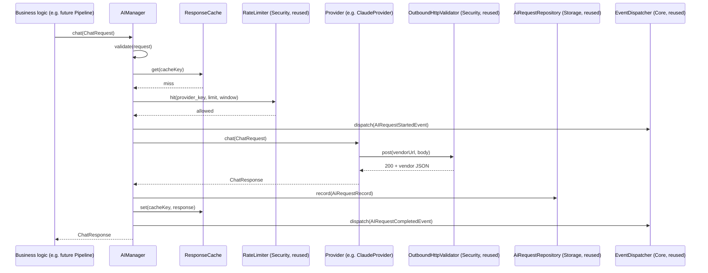
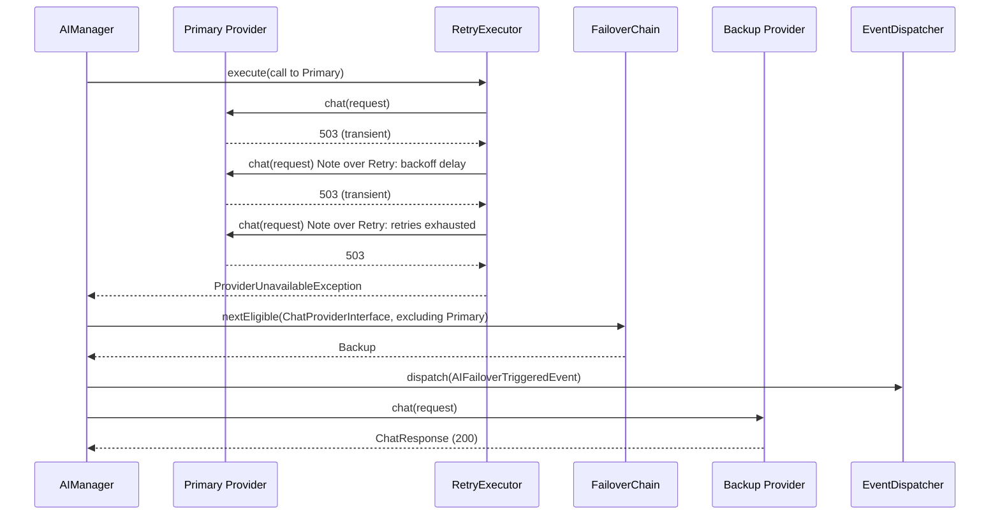
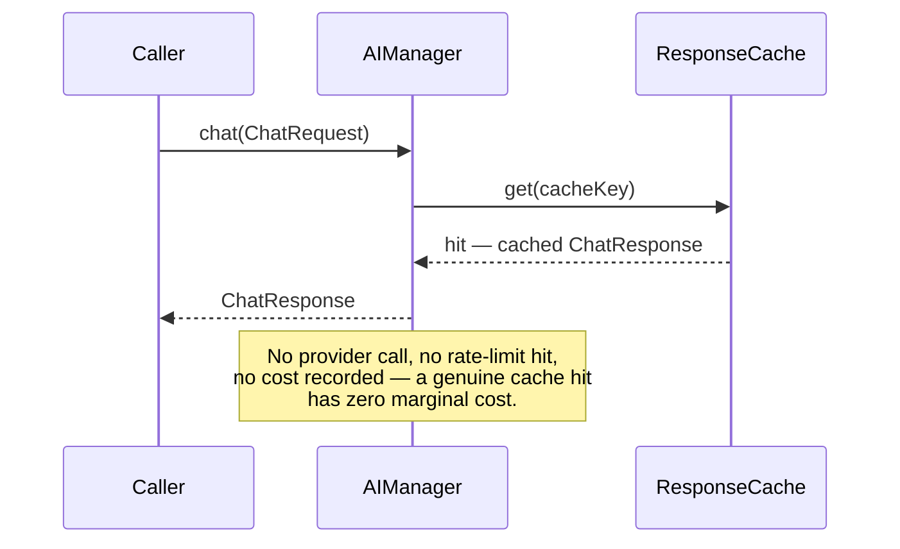

# Module 4: AI Provider Engine — Audit & Design

> Engine-level module of the **AI Publishing Engine**. No implementation code in this document — design only, per workflow. Modules 1–3 are frozen; this module is designed to integrate with them entirely through their existing public interfaces, with zero edits to any frozen file (verified in §9).

---

## PART 1 — ARCHITECTURE AUDIT

### 1.1 What exists today

Nothing in the current codebase makes an AI provider call — Modules 1–3 are pure infrastructure. But Module 3 (Storage) already built the exact seam this module needs, anticipating it:

- **`AiRequestRepositoryInterface`** / **`AiRequestRecord`** — a complete cost/usage ledger contract (provider, model, purpose, correlation_id, prompt/completion tokens, cost_cents, status, error, duration_ms) backed by `ana_ai_requests`. This module writes to it directly. **No new request-history table is needed.**
- **`MetricsRepositoryInterface`** — generic atomic counters + time-series events. This module's "AI metrics" requirement is satisfied by calling it with an `ai.*` key namespace, not by building a parallel metrics system.
- **`Security\Contracts\RateLimiterInterface`** — fixed-window rate limiting, already built. Per-provider rate limits reuse this directly.
- **`Security\Http\OutboundHttpValidator`** / **`UrlGuardInterface`** — SSRF-guarded outbound HTTP. Every provider's HTTP call goes through this, not raw `wp_remote_*`.
- **`Core\Events\EventDispatcherInterface`** + **`EventMetadataFactory`** — the event bus this module's domain events flow through.
- **Storage's migration classes (`Connection`, `MigrationRunner`, `MigrationRecorder`, `AbstractMigration`, `AbstractRepository`) are reusable infrastructure, not tied to Storage's own tables.** This is an important clarification for this module and every one after it: any module can instantiate its *own* `MigrationRunner` against the shared `Connection` to manage its *own* tables, with its own migration list and its own `ActivatableInterface::activate()` hook — Storage's files are frozen from **modification**, not from **reuse**. This module uses that pattern for its two new tables (§3.5).

### 1.2 What the old (pre-rebuild) plugin did, and why it doesn't scale

The v1.0/v1.1 plugin's `ANA_Pipeline` class called `wp_remote_post('https://api.anthropic.com/v1/messages', ...)` directly, hardcoded to Claude, with no retry, no timeout tuning, no capability awareness, no cost tracking beyond ad hoc logging, and no way to add a second provider without duplicating the whole class. Every one of the objectives in this module exists specifically to fix that.

### 1.3 Requirements audit — grouping the long feature list into coherent subsystems

| Group | Requirements | Judgment |
|---|---|---|
| **Capability-segregated interfaces** | `AIProviderInterface`, `ChatProviderInterface`, `ImageProviderInterface`, `EmbeddingProviderInterface`, `SpeechProviderInterface`, `VisionProviderInterface`, `StructuredOutputProviderInterface`, `StreamingProviderInterface` | Interface Segregation — a provider implements only what it supports. Some of these are genuinely separate API calls (image, embedding, speech); others (vision, tool-calling, structured-output) modify the *shape* of a chat call rather than being a separate endpoint — this distinction drives the interface design (§2). |
| **Reliability** | Retry policies, timeouts, rate limiting, provider failover | Belongs in an **orchestrating layer** above individual providers, not inside each provider (§2 trade-off comparison). |
| **Cost & observability** | Token counting, usage tracking, cost calculation, AI metrics, request history, provider health monitoring | Almost entirely satisfied by **reusing** Storage's `AiRequestRepositoryInterface`/`MetricsRepositoryInterface` and Security's `HealthCheckResult` shape — new code is thin. |
| **Prompt management** | Prompt templates, prompt versioning, prompt caching, response caching, prompt history | Two genuinely different things hiding under one heading — provider-native prompt caching (a request flag) vs. plugin-side response caching (ephemeral, transient-backed) vs. durable prompt template storage (two new small tables). Disambiguated in §2.6. |
| **Validation & structured output** | Request validation, structured JSON output | A new `AIRequestValidatorInterface` (deliberately *not* reusing Security's `RequestValidator` name/class — different concern, different namespace, flagged to avoid confusion) plus schema-conformance handling for providers that lack native structured output. |

---

## PART 2 — ARCHITECTURE OPTIONS COMPARED

Four real design decisions, each with genuine trade-offs.

### 2.1 One fat interface vs. segregated capability interfaces vs. flags-on-one-interface

| Option | Description | Trade-off |
|---|---|---|
| **A — One fat interface** | `AIProviderInterface` declares every method (chat, image, embed, speech...); providers throw `UnsupportedOperationException` for what they don't support. | Simple to start. Violates Interface Segregation — every provider class carries dead methods; callers can't tell at the type level what's supported; a new capability means editing every provider. |
| **B — Flags on one interface** | One interface + `supportsCapability(string): bool`; callers check before calling. | Avoids dead methods, but capability checks become runtime string-matching scattered through business logic — exactly the "assuming every provider supports every feature" anti-pattern the requirements explicitly warn against. |
| **C — Segregated interfaces (chosen)** | Each capability is its own interface (`ChatProviderInterface`, `ImageProviderInterface`, ...); a provider implements only the ones it genuinely supports. Callers `instanceof`-check or resolve through capability-aware factory methods. | More interfaces to define up front, but: type-safe capability discovery (PHP's type system enforces it, not string-matching), a new provider naturally declares what it supports by its `implements` clause, and adding a capability to one provider never touches another. This is what the requirements explicitly ask for ("support capability discovery rather than assuming every provider supports every feature"). |

**Decision: C**, supplemented with a `ProviderCapabilities` value object (§2.5) for cases needing a declarative, iterable capability list (e.g. an admin UI listing "what can this provider do") rather than reflection-based `instanceof` chains everywhere.

### 2.2 Where retry/timeout/failover logic lives: inside each provider vs. an orchestrating layer

| Option | Description | Trade-off |
|---|---|---|
| **Provider-internal** | Each `ClaudeProvider`, `OpenAiCompatibleProvider`, etc. implements its own retry loop, timeout handling, failover awareness. | Duplicates the same retry/backoff logic across every provider (violates "no duplicated infrastructure" and DRY); a bug fix in retry logic must be applied N times. |
| **Orchestrating layer (chosen)** | An `AIManager` (or "gateway") wraps calls to providers: applies rate limiting, retry, timeout, failover, response caching, cost recording, and event dispatch *around* a plain provider call. Providers become simple, dumb adapters whose only job is translating this module's generic request/response DTOs to/from one vendor's HTTP API. | Providers stay minimal and easy to add (Single Responsibility). The orchestrator is one place to test reliability behavior. Slight indirection cost — callers go through `AIManager`, not a provider directly — but that indirection is exactly what "every future module communicates only with AI interfaces" requires. |

**Decision: orchestrating layer.** This is the same shape as Security's `CapabilityGate` (thin orchestrator delegating to a `PolicyEngine`) and `RequestValidator` (orchestrator combining nonce+capability+rate-limit) — a proven pattern in this codebase already.

### 2.3 Vendor SDKs vs. raw HTTP

Anthropic, OpenAI, and Google all publish PHP-adjacent SDKs (mostly community-maintained for PHP specifically, official for JS/Python). Pulling any of them in via Composer means: build-size growth, a second place version drift can break the plugin, and — critically — bypassing Security's `OutboundHttpValidator`/SSRF guard unless the SDK's HTTP client is manually reconfigured to route through it, which defeats the purpose of using an SDK at all.

**Decision: raw HTTP via `wp_remote_*` (wrapped in Security's SSRF-guarded validator), no vendor SDKs.** Consistent with every prior module's "no heavy dependencies, WordPress-native HTTP" posture. Each provider is a thin adapter translating this module's DTOs to a JSON request body and back — not meaningfully harder than wrapping an SDK, and it keeps every outbound call inside Security's guard uniformly.

### 2.4 One provider class per vendor vs. one shared OpenAI-compatible adapter for multiple vendors

This is the trade-off with the biggest payoff, based on the capability research in §4: **OpenRouter, DeepSeek, Grok (xAI), and Ollama's compatibility layer all expose an OpenAI-compatible `/chat/completions` schema** — confirmed directly from each vendor's own current documentation (OpenRouter: *"most SDKs work by just swapping the base URL"*; xAI: *"Our API is compatible with OpenAI and Anthropic's SDKs... changing a URL"*; Ollama: *"provides core transformation logic for compatibility with the OpenAI REST API"*).

| Option | Description | Trade-off |
|---|---|---|
| **One class per vendor** | `ClaudeProvider`, `OpenAIProvider`, `GeminiProvider`, `OpenRouterProvider`, `DeepSeekProvider`, `GrokProvider`, `OllamaProvider` — seven near-identical classes for the four that share a schema. | Maximum flexibility per-vendor, but ~70% duplicated request/response mapping code across four classes that are structurally the same API. Directly violates "no duplicated SQL/logic" spirit and the DRY principle the whole codebase has held to. |
| **One generic `OpenAiCompatibleProvider` + config (chosen)** | A single class parameterized by base URL, auth header scheme, and a model catalog, instantiated once per vendor (OpenAI itself, OpenRouter, DeepSeek, Grok, and Ollama's OpenAI-compat endpoint). Claude and Gemini get their own dedicated classes because their request/response shapes are genuinely different (Claude's Messages API content-block structure; Gemini's `generateContent` shape) — forcing them into the "OpenAI-compatible" mold would be the wrong abstraction, not a simplification. | Four vendors collapse into one class + five small config objects; two vendors (Claude, Gemini) get dedicated adapters where the API shape actually differs. New OpenAI-compatible vendors (there are many beyond this list) become a config addition, not a new class — directly serving "allow new providers to be added without changing business logic." |

**Decision: `OpenAiCompatibleProvider` (generic, config-driven) + `ClaudeProvider` + `GeminiProvider` (dedicated).** All three still extend a shared `AbstractHttpProvider` for the genuinely common mechanics (SSRF-guarded HTTP call, timeout, header assembly, error normalization) — so there's no duplication even between the "different" providers at the HTTP-mechanics level.

### 2.5 Capability discovery: pure `instanceof` vs. a declarative capability descriptor

`instanceof ImageProviderInterface` answers "can this class's code handle an image request" — a compile-time-ish, always-true-or-false fact. But some capabilities are model-level, not provider-level (e.g. within "OpenAI," `gpt-image-2` generates images but `gpt-5.5` doesn't; within "Ollama," whether vision works depends on which model the user pulled). A pure `instanceof` check on the provider class can't express that.

**Decision: both.** `instanceof` against the segregated interfaces answers "does this provider *ever* support X" (used for routing/failover eligibility). A `ProviderCapabilities` value object, returned by `AIProviderInterface::capabilities()` and informed by a small `ModelCatalog` per provider, answers "does *this specific model* support X right now" (used for request validation before an expensive call is attempted). This mirrors Anthropic's own current API design, which — per their docs — added a `capabilities` object to their Models API specifically so callers can "discover which capabilities a model supports programmatically" rather than hardcoding assumptions; this module's two-layer discovery is the same idea applied uniformly across all providers, not copied from any one vendor.

### 2.6 Streaming — a necessary honesty check

"Streaming responses" is a listed requirement, but it deserves a clear-eyed look at where it's actually useful in *this* plugin. The Publishing Engine's primary AI consumers (fact-checking, article writing, SEO generation — all in Module 8's future pipeline) run as **background queue jobs** (Module 3's `ana_queue`), not as a live request serving a waiting browser. Streaming a response token-by-token has no observer in that context — the queue worker just wants the final text. Where streaming *does* matter is a hypothetical future interactive chat UI, which isn't in this module's scope.

**Decision:** `StreamingProviderInterface` is designed and implemented as a first-class capability (a provider that supports it returns an iterable of `ChatChunk` via a generator), because the requirement is explicit and a future interactive-UI module should be able to consume it without this module changing. But `AIManager`'s primary path (`chat()`) uses **non-streaming** requests by default, since that's what the actual current consumers need — streaming is opt-in via a distinct `AIManager::streamChat()` method, not the default, and this asymmetry is called out explicitly rather than silently.

### 2.7 Prompt caching vs. response caching — two different things sharing a name

- **Provider-native prompt caching** (Claude's `cache_control` blocks, OpenAI's automatic prompt-prefix caching) reduces *cost* for repeated context within a provider's own infrastructure. This is a **request-shaping concern** — a flag/config passed into the provider adapter's request builder, not a storage concern.
- **Plugin-side response caching** avoids calling a provider *at all* for an identical request within a TTL. This is genuinely ephemeral, expendable data — the same category Security's `RateLimiter` already puts in WordPress transients rather than a database table.

**Decision:** prompt caching is a per-request option threaded into the relevant provider adapters where the vendor supports it (Claude, OpenAI). Response caching is a new `ResponseCacheInterface`, transient-backed (object-cache-aware, consistent with `TransientRateLimiter`'s reasoning) — **no new table**, for the same reason Settings stayed on `wp_options` in Module 3: this data doesn't belong in the "avoid overloading X" category the durable tables were built for; it belongs in the ephemeral-cache category WordPress's own transient API already serves well.

---

## PART 3 — ARCHITECTURE DESIGN

### 3.1 Folder structure

```
src/AI/
├── AIServiceProvider.php
├── Contracts/
│   ├── AIProviderInterface.php            # base: id(), displayName(), capabilities(), healthCheck()
│   ├── ChatProviderInterface.php          # chat(ChatRequest): ChatResponse
│   ├── StreamingProviderInterface.php     # streamChat(ChatRequest): iterable<ChatChunk>
│   ├── VisionProviderInterface.php        # marker — chat() accepts image content parts
│   ├── ToolCallingProviderInterface.php   # marker — chat() accepts/returns tool calls
│   ├── StructuredOutputProviderInterface.php # marker — chat() natively enforces a JSON schema
│   ├── ImageProviderInterface.php         # generateImage(ImageGenerationRequest): ImageGenerationResponse
│   ├── EmbeddingProviderInterface.php     # embed(EmbeddingRequest): EmbeddingResponse
│   ├── SpeechProviderInterface.php        # synthesize()/transcribe()
│   ├── ModelCatalogInterface.php          # per-provider model → capability/pricing lookup
│   ├── RetryPolicyInterface.php
│   ├── FailoverPolicyInterface.php
│   ├── ResponseCacheInterface.php
│   ├── AIRequestValidatorInterface.php    # deliberately NOT named RequestValidatorInterface — see §1.3
│   └── PromptTemplateRepositoryInterface.php
├── DTO/                                    # request/response value objects (provider-agnostic)
│   ├── ChatRequest.php / ChatResponse.php / ChatChunk.php / Message.php / ContentPart.php
│   ├── ImageGenerationRequest.php / ImageGenerationResponse.php
│   ├── EmbeddingRequest.php / EmbeddingResponse.php
│   ├── SpeechRequest.php / SpeechResponse.php / TranscriptionRequest.php / TranscriptionResponse.php
│   ├── ToolDefinition.php / ToolCall.php / ToolResult.php
│   ├── ProviderCapabilities.php
│   └── Usage.php                           # prompt/completion tokens, cost — maps directly to AiRequestRecord
├── Providers/
│   ├── AbstractHttpProvider.php            # shared SSRF-guarded HTTP mechanics (all providers extend this)
│   ├── ClaudeProvider.php
│   ├── GeminiProvider.php
│   └── OpenAiCompatibleProvider.php        # config-driven: OpenAI itself, OpenRouter, DeepSeek, Grok, Ollama
├── Config/
│   └── ProviderConfig.php                  # base URL, auth scheme, default model, per-vendor config value object
├── Manager/
│   ├── AIManager.php                       # the orchestrator — the ONE thing business logic depends on
│   ├── RetryExecutor.php
│   ├── FailoverChain.php
│   └── ExponentialBackoffRetryPolicy.php
├── ModelCatalog/
│   └── StaticModelCatalog.php              # per-provider model list + known capabilities/pricing, filterable
├── Validation/
│   └── AIRequestValidator.php
├── Prompt/
│   ├── PromptTemplate.php                  # value object: name, version, template, variables schema
│   ├── PromptRenderer.php                  # render(template, vars): string
│   └── PromptTemplateRepository.php        # AI-module-owned table, reuses Storage's AbstractRepository
├── Cache/
│   └── TransientResponseCache.php
├── Storage/                                 # AI module's OWN migrations, reusing Storage's reusable classes
│   ├── AiMigrationManifest.php
│   └── Migrations/
│       ├── Migration_..._CreatePromptTemplatesTable.php
│       └── Migration_..._CreatePromptHistoryTable.php
├── Events/
│   ├── AIEvent.php
│   ├── AIRequestStartedEvent.php
│   ├── AIRequestCompletedEvent.php
│   ├── AIRequestFailedEvent.php
│   ├── AIProviderUnavailableEvent.php
│   └── AIFailoverTriggeredEvent.php
├── Health/
│   └── AIProviderHealthCheck.php           # reuses Security's HealthCheckResult, same as Storage's did
├── Exceptions/
│   ├── AIException.php
│   ├── ProviderUnavailableException.php
│   ├── UnsupportedCapabilityException.php
│   └── AIValidationException.php
└── Admin/
    └── AISettingsPage.php                  # extends Core's AbstractSettingsPage
```

### 3.2 Interface design — the core contracts

```php
interface AIProviderInterface {
    public function id(): string;                          // e.g. "claude", "openrouter"
    public function displayName(): string;
    public function capabilities(): ProviderCapabilities;   // declarative descriptor, §2.5
    public function healthCheck(): ProviderHealth;          // last-known-good, latency, error rate
}

interface ChatProviderInterface extends AIProviderInterface {
    public function chat(ChatRequest $request): ChatResponse;
}

interface StreamingProviderInterface extends AIProviderInterface {
    /** @return iterable<ChatChunk> */
    public function streamChat(ChatRequest $request): iterable;
}

interface ImageProviderInterface extends AIProviderInterface {
    public function generateImage(ImageGenerationRequest $request): ImageGenerationResponse;
}

interface EmbeddingProviderInterface extends AIProviderInterface {
    public function embed(EmbeddingRequest $request): EmbeddingResponse;
}

interface SpeechProviderInterface extends AIProviderInterface {
    public function synthesize(SpeechRequest $request): SpeechResponse;
    public function transcribe(TranscriptionRequest $request): TranscriptionResponse;
}

// Marker interfaces — no new method; they certify that ChatProviderInterface::chat()
// accepts the corresponding request shape (image content parts / tool definitions /
// a response_schema) for this provider. Business logic checks `instanceof` before
// setting the corresponding ChatRequest field, rather than hoping every provider
// silently ignores fields it doesn't understand.
interface VisionProviderInterface extends AIProviderInterface {}
interface ToolCallingProviderInterface extends AIProviderInterface {}
interface StructuredOutputProviderInterface extends AIProviderInterface {}
```

`ChatRequest` carries: `messages` (list of `Message`, each with role + list of `ContentPart` — text or image), `model`, `maxTokens`, `temperature`, `tools` (list of `ToolDefinition`, optional), `responseSchema` (optional, for structured output), `promptCaching` (bool, provider-dependent), `stream` (bool). `ChatResponse` carries: `content`, `toolCalls`, `usage` (`Usage` — maps directly onto `AiRequestRecord`'s token/cost fields), `stopReason`, `raw` (the untranslated provider response, for debugging).

### 3.3 `AIManager` — the single entry point business logic depends on

```php
interface AIManagerInterface {
    public function chat(ChatRequest $request, ?string $providerId = null): ChatResponse;
    public function streamChat(ChatRequest $request, ?string $providerId = null): iterable;
    public function generateImage(ImageGenerationRequest $request, ?string $providerId = null): ImageGenerationResponse;
    public function embed(EmbeddingRequest $request, ?string $providerId = null): EmbeddingResponse;
}
```

Every future module (Sources, Pipeline, SEO, Images) depends on `AIManagerInterface` — never on a concrete provider, never on `AIProviderInterface` directly. `$providerId = null` means "use the configured default for this capability"; passing an explicit id is an override, not the normal path. Internally, `chat()`:

1. Validates the request (`AIRequestValidatorInterface`).
2. Resolves the target provider (default, or explicit override), confirming via `instanceof ChatProviderInterface`.
3. Checks the response cache (`ResponseCacheInterface`) — cache hit short-circuits everything below.
4. Checks the rate limiter (Security's `RateLimiterInterface`, reused directly) for this provider.
5. Dispatches `AIRequestStartedEvent`.
6. Calls the provider through `RetryExecutor` (applies `RetryPolicyInterface` — exponential backoff by default — around transient failures: timeouts, 429s, 5xxs).
7. On exhausted retries or a `ProviderUnavailableException`, consults `FailoverPolicyInterface` for the next eligible provider (one that `instanceof ChatProviderInterface` and has matching capabilities) and dispatches `AIFailoverTriggeredEvent`, then retries the whole flow once against the failover target.
8. On success: records the request via `AiRequestRepositoryInterface` (Storage, reused), increments `MetricsRepositoryInterface` counters (Storage, reused), writes the response cache, dispatches `AIRequestCompletedEvent`.
9. On unrecoverable failure: records the failed attempt via `AiRequestRepositoryInterface`, dispatches `AIRequestFailedEvent` (and `AIProviderUnavailableEvent` if the provider itself, not just the request, appears down — informed by `healthCheck()`).

### 3.4 Sequence diagrams

**Happy path, no retry needed:**


**Retry then failover:**


**Response cache hit:**


### 3.5 The two new tables (AI-module-owned, via reused Storage migration mechanics)

**`ana_prompt_templates`** — durable, versioned prompt templates.
| Column | Type |
|---|---|
| id | BIGINT UNSIGNED AUTO_INCREMENT PK |
| name | VARCHAR(191) |
| version | INT UNSIGNED |
| vertical | VARCHAR(50) DEFAULT 'news' |
| template_text | LONGTEXT |
| variables_schema | LONGTEXT (JSON) |
| created_at | DATETIME |

Index: `(name, version)` unique, `(vertical)`.

**`ana_prompt_history`** — which template/version produced which AI request, for reproducibility. Deliberately a *separate* table rather than an `ALTER TABLE ana_ai_requests ADD COLUMN` — Storage's schema is frozen, and a join on `correlation_id` achieves the same reporting need without touching a frozen table.
| Column | Type |
|---|---|
| id | BIGINT UNSIGNED AUTO_INCREMENT PK |
| correlation_id | CHAR(36) |
| prompt_template_id | BIGINT UNSIGNED |
| template_version | INT UNSIGNED |
| rendered_variables_hash | CHAR(32) |
| created_at | DATETIME |

Index: `(correlation_id)`, `(prompt_template_id, template_version)`.

Both created by `AiMigrationManifest` + two `AbstractMigration` subclasses, applied via a **new instance** of Storage's `MigrationRunner` (constructed by `AIServiceProvider`, not shared with Storage's own runner instance) — zero edits to `Storage\Migrations\MigrationManifest` or `StorageServiceProvider`.

---

## PART 4 — CAPABILITY MATRIX

Verified against each vendor's own current (mid-2026) documentation rather than assumed from training data, since these change monthly. **This table is a snapshot for design purposes — `ModelCatalogInterface` implementations are the runtime source of truth, and capability discovery (§2.5) is authoritative over this document at call time.**

| Provider | Chat | Streaming | Vision | Tool calling | Structured output | Image gen | Embeddings | Speech | API shape |
|---|:---:|:---:|:---:|:---:|:---:|:---:|:---:|:---:|---|
| **Claude** (Anthropic) | ✅ | ✅ | ✅ | ✅ | ✅ (GA) | ❌ | ❌ (3rd-party via Voyage AI) | ❌ | Native (Messages API) |
| **OpenAI** | ✅ | ✅ | ✅ | ✅ | ✅ | ✅ (gpt-image-2) | ✅ (text-embedding-3) | ✅ (TTS/Whisper/Realtime) | Native — the compatibility reference |
| **Gemini** (Google) | ✅ | ✅ (Live API) | ✅ | ✅ | ✅ | ✅ (Nano Banana / Imagen) | ✅ (gemini-embedding-2, multimodal) | ✅ (TTS) | Native (`generateContent`) |
| **Grok** (xAI) | ✅ | ✅ | ✅ | ✅ | ✅ | ✅ (Grok Imagine) | ❌ (not offered) | ✅ (TTS/Voice Agent) | OpenAI- and Anthropic-compatible |
| **OpenRouter** | ✅ | ✅ | Varies by routed model | Varies by routed model | Varies by routed model | Rare (model-dependent) | Rare (model-dependent) | ❌ | OpenAI-compatible (aggregator) |
| **DeepSeek** (native API) | ✅ | ✅ | ❌ | ✅ | ✅ | ❌ | ❌ | ❌ | OpenAI-compatible |
| **Ollama** (self-hosted) | ✅ | ✅ | Model-dependent (e.g. llava, qwen-vl) | Model-dependent | ✅ (`format` JSON schema) | ❌ | ✅ (dedicated `/api/embed`) | ❌ | Native + OpenAI-compat layer + Anthropic-compat layer |

**Notable, worth flagging explicitly:** OpenRouter is an aggregator — its *own* capability is "whatever the currently-routed model supports," which is why capability discovery must be live (via `ModelCatalogInterface` querying OpenRouter's own models endpoint), not hardcoded from this table. Ollama is self-hosted, typically at a `localhost`/private-LAN address — this has a direct **Security implication** covered in §5.

---

## PART 5 — SECURITY REVIEW

- **Every outbound provider call goes through `Security\Http\OutboundHttpValidator`**, no exceptions — `AbstractHttpProvider` has no direct `wp_remote_*` call anywhere.
- **Ollama's private-address problem.** `UrlGuardInterface` correctly blocks loopback/private-IP destinations by default (Module 2's SSRF protection). Ollama is *typically hosted* at exactly such an address (`http://localhost:11434` or a private LAN IP). This is a genuine, deliberate exception, not a bug: the site administrator must explicitly add their Ollama host to Security's existing `ai_news_automator_url_allowlist` filter (already built in Module 2 for exactly this kind of legitimate-internal-destination case). **The AI module does not weaken `UrlGuard`'s defaults** — it documents the required admin action in the Ollama provider's own setup instructions.
- **API keys** (Claude, OpenAI, Gemini, OpenRouter, DeepSeek, Grok) are stored via Security's `SecretsProviderInterface` (the `CredentialVault`, table-backed since Module 3's rebinding) — never in plaintext options, never logged. Ollama typically needs no API key (local).
- **Cost-based abuse prevention**: per-provider rate limiting via Security's `RateLimiterInterface` is mandatory, not optional, in `AIManager` — an unbounded retry/failover loop against a paid API is a real cost-exhaustion risk, distinct from (but related to) Security's existing abuse-prevention concerns.
- **Authorization**: any admin action that triggers an AI call on demand (e.g. a "test this provider" button) goes through Security's `CapabilityGateInterface` — a new `ai.manage_providers` ability, following the same fine-grained-capability pattern Security established.
- **Prompt injection is explicitly out of scope for this module** — sanitizing *content fetched from external sources* (RSS feeds, scraped pages) before it becomes part of a prompt is the responsibility of the Sources module (5) and Research module (6), which produce the `ChatRequest` this module sends. This module's job is safely *transporting* a request, not authoring a safe one — stated plainly so it isn't silently assumed to be handled here.
- **Response caching and secrets**: `ResponseCacheInterface`'s cache key is a hash of the request content, never includes the API key, and cached responses are not treated as sensitive (they're AI outputs, not credentials) — but a cache poisoning concern (a malicious actor causing a bad cached response to be served) is mitigated by keying strictly on request content hash + provider + model, with no user-controllable cache-key override exposed.

---

## PART 6 — PERFORMANCE STRATEGY

- **Response cache** avoids provider calls entirely for repeated requests (transient-backed, TTL configurable per capability — e.g. long TTL for embeddings of static content, short/none for chat completions that should reflect fresh context).
- **Retry backoff is exponential with jitter**, capped at a configurable max attempt count — avoids hammering a struggling provider, which would worsen both that provider's degradation and this site's own request queue backlog.
- **Failover eligibility is precomputed** from `instanceof` + `ProviderCapabilities`, not discovered by trial-and-error against each candidate — a failed primary doesn't waste time attempting a provider that structurally can't handle the request (e.g. failing over a vision request to a text-only DeepSeek call).
- **Async execution**: this module's calls happen inside Storage's queue-worker context (Module 7, future) for anything non-trivial — `AIManager` itself is synchronous (a single HTTP round-trip per call), and the *queueing* of AI work (so a slow provider doesn't block a web request) is Module 7's job, not duplicated here.
- **Token counting** is estimated pre-flight (a simple heuristic or provider-reported tokenizer where available) to catch requests that would exceed a model's context window *before* an expensive call, not just after a 400 error.
- **No connection pooling** (not a PHP/WordPress-request-lifecycle concept, same caveat as Storage's design) — each request is a fresh `$wpdb`-adjacent HTTP call via `wp_remote_*`.

---

## PART 7 — TESTING STRATEGY

- **Mock/fake providers**: a `FakeChatProvider` (implements `ChatProviderInterface`, returns configurable canned responses or throws configurable exceptions) is the primary tool for testing `AIManager`'s orchestration logic (retry, failover, caching, event dispatch) without any real HTTP call — mirrors the `FakeWpdb` approach from Module 3.
- **Retry tests**: assert `RetryExecutor` attempts the configured number of times, with correct backoff timing math, and stops on non-transient errors (e.g. a 400 validation error should never be retried, only 429/5xx/timeout).
- **Failover tests**: assert `FailoverChain` selects only capability-eligible providers, in configured priority order, and emits `AIFailoverTriggeredEvent` exactly once per actual failover.
- **Timeout tests**: assert a provider call respects the configured timeout and surfaces a `ProviderUnavailableException` (classified as transient, retry-eligible) rather than an unhandled fatal.
- **Streaming tests**: assert `StreamingProviderInterface` implementations yield chunks incrementally (via a fake generator) and that `AIManager::streamChat()` correctly aggregates a final `Usage` after the stream completes.
- **Integration tests** (documented as requiring real provider credentials, not run in CI by default): one smoke test per real provider adapter, gated behind an environment flag, verifying the adapter correctly parses that vendor's actual response shape — these catch API drift a fake provider cannot.
- **Same honest limitation as every prior module**: no PHP/network runtime available in this build environment to execute any of the above here. Unit tests (fake-provider-based) are genuinely offline-runnable and will be written at implementation time; integration tests are documented but require real credentials and a live environment.

---

## PART 8 — API DESIGN (illustrative usage, not implementation)

```php
// A future Pipeline module's fact-check step:
$response = $this->aiManager->chat(new ChatRequest(
    messages: [Message::user('Verify this claim against the source: ...')],
    model: 'claude-sonnet-5',
    maxTokens: 1000,
    responseSchema: FactCheckResult::jsonSchema(),
));

// Explicit provider override, e.g. an admin "test connection" action:
$response = $this->aiManager->chat($request, providerId: 'openrouter');

// Image generation, capability-checked implicitly by AIManager:
$image = $this->aiManager->generateImage(new ImageGenerationRequest(
    prompt: 'Editorial illustration of...',
    size: '1024x1024',
));
```

Business logic never instantiates a provider class, never checks `instanceof` itself (that's `AIManager`'s job internally), and never touches `AiRequestRepositoryInterface` directly for AI calls — `AIManager` records that automatically. This is what "every future module communicates only with AI interfaces" means concretely.

---

## PART 9 — INTEGRATION VERIFICATION (no duplicated infrastructure)

| Need | Reused from | New code |
|---|---|---|
| Request/cost history | Storage `AiRequestRepositoryInterface` (as-is) | None |
| AI metrics/counters | Storage `MetricsRepositoryInterface` (as-is) | None |
| Rate limiting | Security `RateLimiterInterface` (as-is) | None |
| Outbound HTTP + SSRF guard | Security `OutboundHttpValidator` (as-is) | None |
| Secrets (API keys) | Security `SecretsProviderInterface`/`CredentialVault` (as-is) | None |
| Authorization | Security `CapabilityGateInterface` (as-is) | One new ability constant |
| Events | Core `EventDispatcherInterface`/`EventMetadataFactory` (as-is) | 5 new event classes |
| Settings page | Core `AbstractSettingsPage` (as-is) | One new settings page |
| Health check shape | Security `HealthCheckResult` (as-is, 3rd module to reuse it) | One new health check class |
| Migrations | Storage's `Connection`/`MigrationRunner`/`MigrationRecorder`/`AbstractMigration` classes (instantiated fresh, not modified) | 2 new tables, this module's own manifest |
| Repository base | Storage `AbstractRepository` (as-is) | One new repository (prompt templates) |

Zero files in `src/Core/`, `src/Security/`, or `src/Storage/` require modification. `ModuleManifest` gets one addition (`AIServiceProvider::class`, positioned after Storage) — the same designed extension point used for both prior modules.

---

## PART 10 — EXTENSION GUIDE (how a future provider gets added)

1. If the vendor's API is OpenAI-compatible: add a `ProviderConfig` entry (base URL, auth header, model catalog) — no new class.
2. If it isn't: create one new class extending `AbstractHttpProvider`, implementing whichever capability interfaces it genuinely supports.
3. Register it in `AIServiceProvider` (tagged `ai.providers`, following the same container-tagging pattern Security uses for its policy engine) — no other file changes.
4. `AIManager`, `FailoverChain`, and every business-logic consumer immediately see the new provider without modification, because they depend only on the segregated interfaces.

## PART 11 — FUTURE ROADMAP (explicitly out of scope for this module)

- **Fine-tuning / model training APIs** — not needed by any current module.
- **Batch API support** (several vendors offer discounted async batch processing) — a real future cost optimization once Module 7's queue exists to naturally batch requests; deferred until that module exists to drive real usage patterns, avoiding speculative design.
- **Multi-provider cost arbitrage** (automatically routing to the cheapest capable provider) — `FailoverPolicyInterface` handles *availability*-driven failover now; *cost*-driven routing is a genuinely different policy that deserves its own design once real cost data exists in `ana_ai_requests` to inform it.
- **Video generation** — several vendors now offer it (Gemini's Veo, Grok Imagine's video), but no current or planned module needs it; `AIProviderInterface`'s capability-interface pattern means adding `VideoProviderInterface` later is additive, not a rewrite.

---

## OPEN DECISIONS FOR YOUR SIGN-OFF

1. **`OpenAiCompatibleProvider` consolidation** (§2.4) — confirm collapsing OpenAI/OpenRouter/DeepSeek/Grok/Ollama-compat into one config-driven class, rather than seven separate classes.
2. **AI module owns two new tables via its own migration manifest**, reusing but not modifying Storage's migration classes (§3.5, §9) — confirm this reading of "reusable infrastructure, frozen files" is the intended interpretation of the freeze.
3. **Response caching is transient-backed, not a new table** (§2.7) — confirm, consistent with the Settings/RateLimiter precedent.
4. **Streaming is implemented but not the default path** (§2.6) — confirm this honest scoping rather than presenting streaming as equally central to the non-streaming path.
5. **Naming**: `AIRequestValidatorInterface` (AI module) vs. Security's existing `RequestValidator`/`RequestValidatorInterface` — confirm this is sufficiently distinct (different namespace, different concern: request *shape* validation vs. nonce/capability/rate-limit *authorization*) rather than a naming collision risk you'd rather I resolve differently.
6. **"AI Creator OS"** — flagged at the top of this response; confirm you want to keep the established "AI Publishing Engine" name, or want a formal (bounded, docs-only) rename.

Waiting for approval before writing any implementation code.
