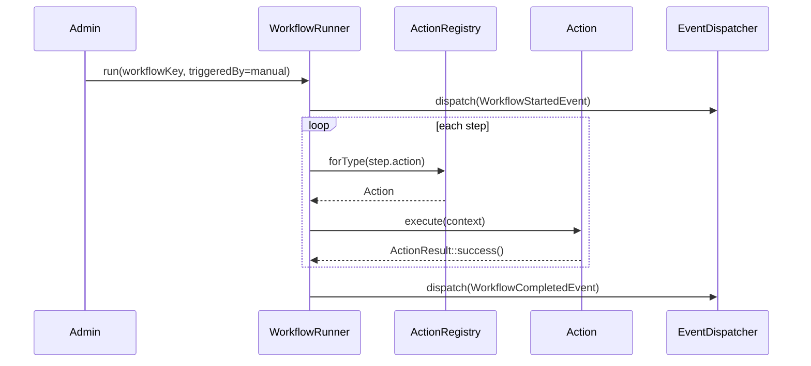
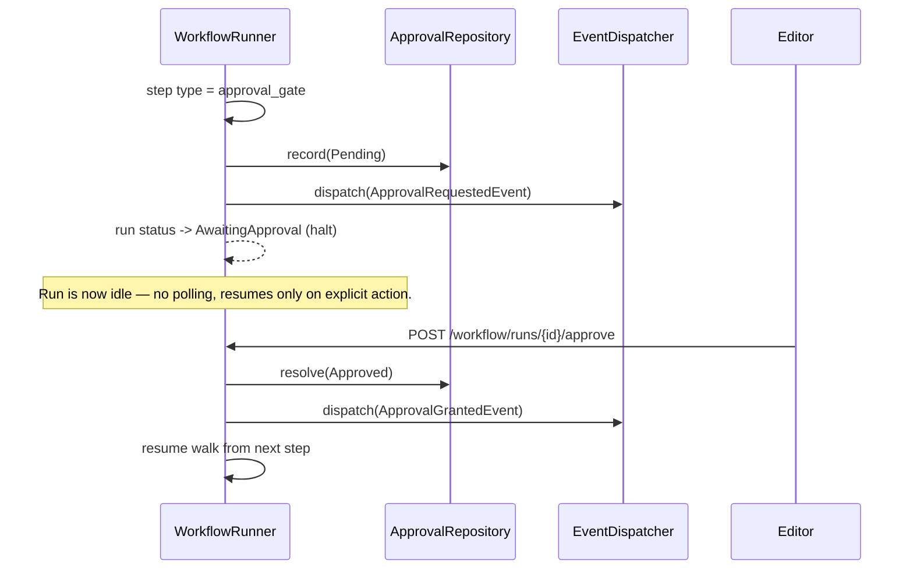
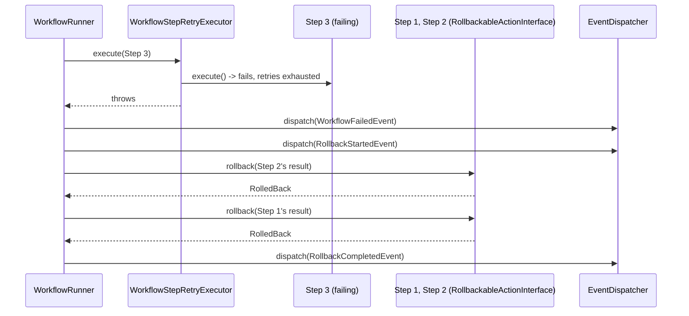

# Module 7: Workflow Engine — Audit & Design

> Orchestration-layer module of the AI Publishing Engine. No implementation code in this document — design only, following the same Design → Approval → Build → Verify → Test → Document sequence used for Module 6. Modules 1–6 are frozen; every integration point below is designed against their existing public interfaces, verified by direct inspection (not memory) before this document was written.

---

## PART 0 — AUDIT

### 0.1 Reused as-is (confirmed by direct inspection, not assumed)

| Interface | Module | Used for |
|---|---|---|
| `QueueRepositoryInterface` / `JobHistoryRepositoryInterface` | Storage (3) | Queuing long-running workflow steps — `enqueue(jobType, payload, priority, runAfter, correlationId)`, confirmed exact signature |
| `EventDispatcherInterface` / `EventMetadataFactory` | Core (1) | Workflow's own events, and the Event trigger type's subscription mechanism |
| `CapabilityGateInterface` / `PolicyInterface` extension point | Security (2) | Authorization — new abilities added via policy registration (Research's precedent), zero `Capabilities.php` changes |
| `MetricsRepositoryInterface` | Storage (3) | Execution metrics |
| `LoggerInterface`, `ConfigRepositoryInterface` | Core (1) | Logging, configuration |
| `Connection` / `MigrationRunner` / `MigrationRecorder` / `AbstractMigration` / `SchemaBuilder` / `AbstractRepository` | Storage (3) | Reused per ADR-0006 for Workflow's own new tables — zero Storage files modified |
| Registry pattern (`ProviderRegistryInterface`, `SourceConnectorRegistryInterface`) | AI (4) / Sources (5) | Mirrored exactly for `ActionRegistryInterface` — "Workflow itself must know only interfaces" is the same discovery-separated-from-orchestration shape used twice already |
| `ResearchSessionManager` / `ResearchSummary` | Research (6) | Consumed only through a `StartResearchAction` implementing `ActionInterface` — Workflow never imports Research's internals directly, same boundary discipline as every prior module |

### 0.2 The seam that does NOT do what its name suggests

`Storage\Contracts\WorkflowRepositoryInterface` / `ana_workflows` (Module 3) — verified directly:

```php
interface WorkflowRepositoryInterface {
    public function find(int $id): ?WorkflowRecord;
    public function forVertical(string $vertical, bool $enabledOnly = true): array;
    public function save(WorkflowRecord $workflow): int;   // mutable — updates in place
    public function delete(int $id): bool;                  // exists
}
```

`WorkflowRecord`'s own docblock: *"a configured pipeline definition for the Pipeline module (8)."* No version column. `save()` is a plain upsert; `delete()` removes rows outright.

This table was Storage's own anticipation of a **future need**, written before this module's actual requirements were specified — and what it anticipated (a simple, mutable, named config blob) is not what this module's approved requirement describes (*"Workflow definitions are immutable. New versions create new records. Never overwrite history."*). This is a real, load-bearing design conflict, not a preference — addressed head-on in Part 1, not silently routed around.

### 0.3 Requirements audit — grouping the long feature list

| Group | Requirement | Judgment |
|---|---|---|
| Definition & versioning | Workflow Registry, Definition Loader, immutable versioning | Needs new Workflow-owned storage — see Part 1 |
| Execution | Runner, Triggers (4 types), Action system, Conditional engine | Core new orchestration logic |
| Human-in-the-loop | Approval (4 states), audited | New Workflow-owned table |
| Reliability | Rollback, retry (ADR-0017-scoped), scheduling | Rollback + retry are new; scheduling reuses Sources' precedent with an explicit scope note (Part 2.6) |
| Observability | Audit trail, events, metrics | Mostly reuse (`MetricsRepositoryInterface`) + new event classes |
| Surfaces | REST API, Admin UI | New, following Research's controller/settings-page pattern exactly |

---

## PART 1 — THE VERSIONING TENSION (needs your decision)

### Option A — Workflow owns its own versioned definition table (recommended)

A new table, `ana_workflow_definitions` (Workflow-owned, via reused Storage migration classes per ADR-0006), holding immutable, write-once versions: `(id, workflow_key, version, definition JSON, created_at)`, `UNIQUE(workflow_key, version)`. Same discipline as AI's `PromptTemplate` (Module 4) — a repository with no `update()` method, `saveNewVersion()` that throws on a duplicate `(workflow_key, version)` pair, `version_compare()`-based ordering for "latest."

`Storage\Contracts\WorkflowRepositoryInterface`/`ana_workflows` is **not used by Module 7 at all** — left exactly as it is, available for whatever Module 8 (Publishing) actually needs it for, matching its own documented original intent.

**Trade-off:** Two tables in the system with "workflow" in the name (Storage's `ana_workflows`, Workflow's own `ana_workflow_definitions`) could read as redundant to someone unfamiliar with the history. Mitigated by clear documentation (this doc + the module README) explaining why, and by the fact that `ana_workflows` genuinely goes unused by this module — not duplicated, simply bypassed.

### Option B — Layer versioning on top of `ana_workflows` via naming convention

Encode version into `WorkflowRecord::$name` (e.g., `"publish-article@2"`) and never call `save()` for an existing id.

**Rejected:** The interface itself provides no enforcement — nothing stops a future caller from calling `WorkflowRepositoryInterface::save()` on an existing id and silently violating immutability, since that's exactly what the interface is built to do. Encoding version into a name string is also a worse data model than a dedicated column, and abuses a field Storage designed for something else.

### Option C — Hybrid: `ana_workflows` as a mutable "pointer," a new table for immutable history

`ana_workflows` row represents "this workflow exists, here's its vertical/enabled flag, here's a cached copy of the current version's definition." A new Workflow-owned table stores every immutable version. Module 7 keeps the cache in sync on every new version.

**Rejected in favor of A:** Adds real complexity (two sources of truth to keep consistent, a cache-invalidation surface) for a benefit Option A already gets for free (Storage's `forVertical()`/`find()` aren't needed by Module 7 either, since the new table can expose the same query shapes directly).

**Recommendation: Option A.** Confirm before implementation begins — this decision shapes every other part of this design.

---

## PART 2 — ARCHITECTURE

### 2.1 Folder structure

```
src/Workflow/
├── WorkflowServiceProvider.php
├── Contracts/
│   ├── ActionInterface.php              # execute(WorkflowRunContext): ActionResult
│   ├── RollbackableActionInterface.php  # extends ActionInterface; rollback(WorkflowStepResult): RollbackResult
│   ├── ActionRegistryInterface.php      # mirrors ProviderRegistryInterface/SourceConnectorRegistryInterface exactly
│   ├── TriggerInterface.php             # one per trigger type (Manual/Event/Scheduled/API)
│   ├── ConditionEvaluatorInterface.php
│   ├── WorkflowDefinitionRepositoryInterface.php  # the new versioned-storage contract (Part 1, Option A)
│   ├── WorkflowRunRepositoryInterface.php
│   ├── WorkflowStepResultRepositoryInterface.php
│   ├── ApprovalRepositoryInterface.php
│   └── WorkflowRetryPolicyInterface.php  # ADR-0016-shaped, module-local per ADR-0017
├── DTO/
│   ├── WorkflowDefinition.php            # parsed form of the JSON definition
│   ├── WorkflowRunContext.php            # what an Action receives: run id, step input, correlation id
│   ├── ActionResult.php                  # success/failure + output payload
│   ├── RollbackResult.php
│   └── StepDefinition.php                # one step within a WorkflowDefinition: key, action type, config, condition
├── Entities/
│   ├── WorkflowRunStatus.php (enum)
│   ├── StepStatus.php (enum)
│   ├── ApprovalStatus.php (enum)
│   ├── WorkflowDefinitionVersion.php
│   ├── WorkflowRun.php
│   ├── WorkflowStepResult.php
│   └── Approval.php
├── Repositories/                          # reuse Storage's AbstractRepository, ADR-0006
├── Registry/
│   └── ActionRegistry.php
├── Runner/
│   ├── WorkflowRunner.php                 # the orchestrator — mirrors AIManager/ResearchSessionManager's role
│   └── ConditionEvaluator.php
├── Actions/                               # Workflow's OWN generic actions only
│   ├── WaitAction.php
│   ├── BranchAction.php                   # not a real "action" in the execution sense — see 2.4
│   ├── ApprovalGateAction.php
│   ├── NotificationAction.php
│   └── QueueJobAction.php                 # generic "enqueue any Storage job type" action
├── Triggers/
│   ├── ManualTrigger.php
│   ├── EventTrigger.php
│   ├── ScheduledTrigger.php
│   └── ApiTrigger.php
├── Retry/
│   └── WorkflowStepRetryExecutor.php      # ADR-0017: narrow, module-local, no Core extraction
├── Scheduling/
│   └── WorkflowScheduler.php              # see 2.6 — explicit relationship to Sources' precedent
├── Storage/ (Workflow's own migrations, reusing Storage's classes)
├── Events/ (10 events per the requirement list)
├── Health/
├── Admin/
└── Api/
```

**Note on `StartResearchAction` and `PublishDraftAction`:** these are NOT in `src/Workflow/Actions/` — they belong to Research (6) and Publishing (8) respectively, each registering their own `ActionInterface` implementation via their own service provider's `ActionRegistryInterface::register()` call. Workflow's own `Actions/` folder holds only the generic, module-agnostic actions (Wait, Approval, Notification, generic Queue-a-job) — this is the literal meaning of "Workflow must not contain business logic."

### 2.2 The Action system — mirroring the established registry pattern for the third time

```php
interface ActionInterface {
    public function type(): string;  // matches a step's "action" key in the definition JSON
    public function execute(WorkflowRunContext $context): ActionResult;
}

interface RollbackableActionInterface extends ActionInterface {
    public function rollback(WorkflowStepResult $result): RollbackResult;
}

interface ActionRegistryInterface {
    public function register(ActionInterface $action): void;
    public function forType(string $type): ?ActionInterface;
    /** @return list<ActionInterface> */
    public function all(): array;
}
```

A future Research/Publishing action registers itself the same way Sources' connectors and AI's providers do — `WorkflowServiceProvider` never hardcodes knowledge of `StartResearchAction`'s existence; Research's own service provider (once it adds this action, a small follow-up to Module 6, not part of this design) calls `$container->get(ActionRegistryInterface::class)->register(new StartResearchAction(...))` in its own `boot()`.

### 2.3 The Runner

`WorkflowRunner` is the orchestration entry point — mirrors `AIManager`/`ResearchSessionManager`'s role exactly:

1. Resolve the `WorkflowDefinitionVersion` (latest, or a pinned version if the run specifies one — a run always records which exact version it executed, since a definition can gain a new version mid-run-history and old runs must remain explainable against the version they actually ran).
2. Create a `WorkflowRun` row (status `Pending` → `Running`).
3. Walk the definition's steps in order, resolving each step's `ActionInterface` via `ActionRegistryInterface`.
4. Before each step: evaluate its condition (if any) via `ConditionEvaluatorInterface` against the accumulated run context — skip (status `Skipped`) if false.
5. Execute the step through `WorkflowStepRetryExecutor` (ADR-0017 — ownnarrow retry, ex retryable/non-retryable classification mirroring `SourceFetchErrorType`'s shape, but scoped to step-execution failures).
6. Long-running steps: the action itself decides — an action can return `ActionResult::deferred($queueJobId)`, meaning the Runner marks the step `Running` and returns; the actual completion happens later via `QueueRepositoryInterface`'s existing job-completion mechanism (reused, not reimplemented) triggering a Runner resume call. Fast/synchronous steps just return `ActionResult::success()`/`failure()` inline.
7. An `ApprovalGateAction` transitions the run to `AwaitingApproval` and halts the walk — resumption is an explicit REST/admin action (`POST /workflow/runs/{id}/approve`), never automatic.
8. On any step failure that exhausts retry: run transitions to `Failed`; if any completed steps implement `RollbackableActionInterface`, they're rolled back in reverse order (best-effort — see 2.5).
9. On successful completion of all steps: run transitions to `Completed`.

### 2.4 The Conditional Engine — `if`/`else`/`switch` are data, not actions

A step's `condition` field in the definition JSON is evaluated by `ConditionEvaluatorInterface` against the run's accumulated context (prior steps' outputs) — simple field-comparison expressions (`{"field": "research.overallConfidence", "operator": "gte", "value": 0.7}`), not an arbitrary expression language (no `eval()`, no user-supplied PHP — a deliberate security boundary, see Part 5). `switch` is modeled as a step with multiple possible `next` targets keyed by a field's value, resolved the same way. `success`/`failure`/`retry`/`timeout` are not separate "conditions" but **outcomes of `ActionResult`** that the Runner's own step-loop already branches on (2.3, steps 5–8) — listing them under "Conditional Engine" in the requirements is naming the Runner's own control flow, not a fifth condition type needing its own evaluator.

### 2.5 Rollback — honest scope, not oversold

`RollbackableActionInterface::rollback()` returns a `RollbackResult` with one of three outcomes: `RolledBack`, `RollbackFailed`, or `NotReversible` (an action can legitimately declare "I cannot be undone," e.g. a sent notification — the Runner records this and moves on rather than pretending success). Rollback walks completed steps in reverse order; a `RollbackFailed`/`NotReversible` result on one step does not block attempting rollback on earlier steps — best-effort, exactly as the requirement says, not a transactional guarantee (mirrors Storage's own honest scoping of migration rollback since Module 3).

### 2.6 Scheduling — explicit relationship to Sources' precedent, not silently repeating it

ADR-0016 anticipated a "future dedicated Scheduler module" that would generalize Sources' narrow `SourceSyncScheduler`. Module 7 is plausibly that module in spirit — but the current instruction is explicit: **do not touch Modules 1–6.** `WorkflowScheduler` is therefore built as its own independent WP-Cron hook (following the exact same narrow, job-type-scoped pattern Sources established, including the same defensive "release foreign job types back to pending" safety net Sources' scheduler needed), **not** as a migration target Sources is moved onto in this pass. That migration — if it happens at all — is a future, separately-approved decision, exactly as ADR-0016 itself specified. Flagged here so it isn't assumed to happen implicitly.

### 2.7 Versioning + Runner interaction

Every `WorkflowRun` records the exact `(workflow_key, version)` it executed — resolved once at trigger time, never re-resolved mid-run. This is what makes "never overwrite history" actually meaningful operationally: a workflow definition can be edited (a new version created) while older runs are still in flight or being reviewed, and every run remains fully explainable against the exact definition it ran, not whatever the definition happens to be now.

---

## PART 3 — DATABASE SCHEMA (Workflow-owned, 4 new tables via reused Storage migration classes)

| Table | Purpose | Key columns |
|---|---|---|
| `ana_workflow_definitions` | Immutable, versioned definitions (Part 1, Option A) | `workflow_key`, `version`, `definition` (JSON), `created_at`; `UNIQUE(workflow_key, version)` |
| `ana_workflow_runs` | One execution instance | `workflow_key`, `version`, `run_correlation_id`, `status`, `triggered_by`, `user_id`, `started_at`, `completed_at`, `error` |
| `ana_workflow_step_results` | One step's outcome within a run | `run_id`, `step_key`, `action_type`, `status`, `input` (JSON), `output` (JSON), `error`, `rollback_status`, `started_at`, `completed_at` |
| `ana_workflow_approvals` | Human approval gates | `run_id`, `step_key`, `status`, `requested_at`, `decided_at`, `decided_by`, `reason` |

No formal FK constraints (ADR-0004, consistent with every prior module). `ana_workflow_runs`/`ana_workflow_step_results` retention follows the same `BatchPurger`-based pattern Storage/Sources established — long-running installs shouldn't accumulate unbounded execution history.

---

## PART 4 — SEQUENCE DIAGRAMS

**Manual trigger, all-synchronous steps, no approval needed:**


**Approval gate pausing and resuming a run:**


**Step failure triggering rollback:**


---

## PART 5 — SECURITY REVIEW

- **No expression evaluation, no `eval()`, no user-supplied PHP anywhere in the Conditional Engine** (2.4) — condition definitions are structured JSON (field/operator/value), parsed and compared, never executed as code. This is a deliberate, hard boundary given workflow definitions may eventually be admin-editable JSON.
- **Every write operation requires a capability**, via the same policy-registration extension mechanism Research used (new abilities `workflow.manage` → `Capabilities::RUN_PIPELINE`, `workflow.approve` → `Capabilities::APPROVE_CONTENT`, `workflow.view` → `Capabilities::VIEW_ANALYTICS`) — zero modification to Security's `Capabilities` class, verified as the correct extension point in Module 6's audit.
- **No direct SQL outside repositories** — every table access goes through a Workflow-owned repository extending Storage's `AbstractRepository`, same as every prior module.
- **No unsafe serialization** — step input/output persisted as JSON (`wp_json_encode`/`json_decode`), never PHP `serialize()`/`unserialize()`, which would be an object-injection risk given this data could plausibly be influenced by external trigger payloads (Event/API triggers).
- **API trigger authentication**: the API trigger type requires the same REST authorization path as every other write endpoint (`RestSecurityMiddleware::requireAbility()`) — an externally-triggered workflow run is not a lower-trust path than an admin-initiated one.
- **Approval audit**: every approval decision records `decided_by` (user id) and `reason`, immutable once recorded (the requirement's own "audit every decision" — no update path on a resolved approval record).

---

## PART 6 — ADR-0017 COMPLIANCE PLAN

`WorkflowStepRetryExecutor` (in `src/Workflow/Retry/`) will be built following the *exact* shape ADR-0016/0017 already established for `SourceRetryExecutor`: a single concrete class, no `RetryPolicyInterface` abstraction layer, its own narrow error classification (`WorkflowStepErrorType`: retryable transient step failures vs. non-retryable ones), duplicating the algorithm, not AI's or Sources' architecture. This is explicitly the **third** instance ADR-0017 already anticipated and pre-approved the deferral for — no new ADR needed, this design simply executes what ADR-0017 already decided. No modification to `AI\Manager\RetryExecutor` or `Sources\Retry\SourceRetryExecutor`.

---

## PART 7 — PERFORMANCE STRATEGY

- Long-running steps are queued (via `QueueRepositoryInterface`, reused) rather than blocking the Runner synchronously — consistent with every prior module's "never run long work inline on a web request" discipline.
- `ana_workflow_step_results`/`ana_workflow_runs` retention via `BatchPurger` (reused).
- Condition evaluation is pure in-memory comparison — no additional queries per condition check.
- The Runner resolves a run's `ActionInterface` instances once per step via the registry (a simple array lookup, not a container resolution per step) — cheap regardless of workflow length.

## PART 8 — TESTING STRATEGY

Same posture as Module 6, informed directly by the release-candidate audit's findings: fake `ActionInterface`/`TriggerInterface` implementations for Runner orchestration tests (mirroring `FakeChatProvider`/`FakeSourceConnector`); **real repository tests against `FakeWpdb` from the start** (not deferred to a remediation pass, per the audit's Issue 3 lesson); a state-guard test for every `WorkflowRun`/`Approval` status transition, including invalid ones (per the audit's Issue 1 lesson — every terminal-state guard gets an explicit "cannot transition from X" test, not just the happy path); event-ordering tests for every dispatch sequence (per Issue 2); an authorization policy test suite from the start (per Issue 4). "Target coverage should exceed Module 6 standards" is read as: the gaps the RC audit found in Module 6 are addressed in Module 7's *first* test pass, not discovered afterward.

---

## PART 9 — INTEGRATION VERIFICATION (no duplicated infrastructure)

| Need | Reused from | New code |
|---|---|---|
| Job queuing | Storage `QueueRepositoryInterface`/`JobHistoryRepositoryInterface` (as-is) | None |
| Events | Core `EventDispatcherInterface`/`EventMetadataFactory` (as-is) | 10 new event classes |
| Authorization | Security `PolicyInterface` extension point (as-is) | One new policy, 3 new abilities, zero `Capabilities.php` changes |
| Metrics | Storage `MetricsRepositoryInterface` (as-is) | None |
| Migrations | Storage's `Connection`/`MigrationRunner`/`MigrationRecorder`/`AbstractMigration`/`AbstractRepository` (instantiated fresh, not modified) | 4 new tables, Workflow's own manifest |
| Discovery pattern | AI `ProviderRegistryInterface` / Sources `SourceConnectorRegistryInterface` (pattern reused, not the code itself) | `ActionRegistryInterface` |
| Retry pattern | Sources `SourceRetryExecutor` (pattern reused per ADR-0017, not the code itself) | `WorkflowStepRetryExecutor` |
| Research consumption | `Research\Contracts\SessionRepositoryInterface::summarize()` (as-is, via a future `StartResearchAction`) | None in Module 7 itself |
| `ana_workflows` (Storage) | **Not used** — see Part 1 | `ana_workflow_definitions` (new, Workflow-owned) |

Zero files in `src/Core/`, `src/Security/`, `src/Storage/`, `src/AI/`, `src/Sources/`, or `src/Research/` require modification. `ModuleManifest` gets one addition (`WorkflowServiceProvider::class`, positioned seventh) — the same designed extension point used for every prior module.

---

## OPEN DECISIONS FOR YOUR SIGN-OFF

1. **Part 1 — the versioning tension.** Recommending Option A (Workflow owns its own versioned `ana_workflow_definitions` table; `ana_workflows` goes unused by this module). This is the single decision every other part of this design depends on — please confirm before implementation begins.
2. **Part 2.6 — scheduling relationship to Sources.** Confirm `WorkflowScheduler` is built as its own independent cron hook in this pass, with any future migration of Sources onto it treated as a separate, explicitly-approved decision — not something this module silently sets up to happen automatically.
3. **Part 2.3 — deferred/long-running step model.** Confirm the `ActionResult::deferred($queueJobId)` pattern (an action opts into async completion by returning a deferred result, resumed via the existing queue-completion mechanism) is the right shape, rather than e.g. every step always being queued regardless of whether it needs to be.
4. **Capability mapping (Part 5)**: `workflow.manage`→`RUN_PIPELINE`, `workflow.approve`→`APPROVE_CONTENT`, `workflow.view`→`VIEW_ANALYTICS` — confirm these are the right existing capabilities to reuse, consistent with Research's precedent.

Waiting for approval before writing any implementation code.
