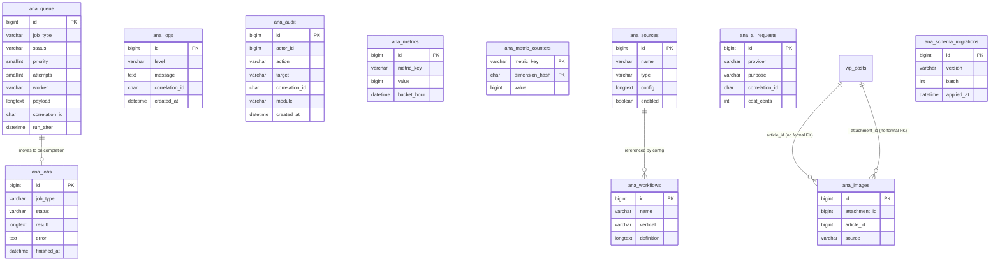

# Module 3: Storage — Audit & Design

> Engine-level module of the **AI Publishing Engine**. No code in this document — design only, per workflow. Waiting for approval before implementation.

---

## PART 1 — AUDIT

### 1.1 Current persistent-storage inventory

Everything the engine has stored so far lives in `wp_options`, one row per concern:

| Option key | Owner | Shape |
|---|---|---|
| `ai_news_automator_log` | Core `OptionBackedLogger` | flat array, capped at 200 entries |
| `ai_news_automator_audit_log` | Security `OptionBackedAuditRepository` | flat array, capped at 500 entries |
| `ai_news_automator_security_metrics` | Security `SecurityMetrics` | flat key→int counter map |
| `ai_news_automator_secrets` | Security `CredentialVault` | keyed map of encrypted records |
| `ai_news_automator_version` / `_activated_at` | Core `Activator` | scalars |

No dedicated tables exist. No Queue, Articles, Sources, Workflows, AI Requests, or Images storage exists yet — those modules haven't been built, so this is greenfield for them.

### 1.2 Weaknesses in the current approach

| # | Weakness | Why it matters at scale |
|---|---|---|
| W1 | **Whole-blob rewrite per write.** Every `log()`/audit call reads the *entire* option array, appends one entry, and writes the *entire* array back via `update_option`. | O(n) cost per write; at high log volume this becomes the dominant cost of every request. |
| W2 | **Lost-update race.** Two concurrent requests both read the same array, each appends a different entry, the second write clobbers the first. | Under real traffic (multiple cron/webhook requests overlapping), entries silently vanish — no error, just data loss. |
| W3 | **No querying.** Filtering by date range, level, correlation ID, or actor requires loading the whole blob into PHP and iterating in userland. | Any audit/log UI beyond "last 50" is either slow or impossible. |
| W4 | **Hard truncation, not retention.** Old entries are discarded via `array_slice`, not archived or policy-driven. | No way to keep 90 days of audit history for compliance while trimming logs at 7 days — it's one arbitrary count for everything. |
| W5 | **No schema for structured domains.** Queue jobs, sources, workflows, AI request costs, and images all need typed columns, statuses, and relationships that a serialized array cannot represent safely (e.g. atomic status transitions, indexed lookups by status). | These modules (5, 7, 8, and others) cannot be built correctly on `wp_options`. |
| W6 | **No transactions.** A sequence of related writes (e.g. "mark job complete AND write its history record") has no atomicity — a mid-sequence failure leaves inconsistent state. | Silent data corruption under any partial failure (PHP timeout, fatal error, process kill). |
| W7 | **No migration/versioning system.** Module 2 added a capability installer for activation-time setup, but there is no general schema-versioning framework. | Every future module would reinvent ad hoc "did I already set this up" checks. |
| W8 | **No enforced repository boundary.** Nothing today calls `$wpdb` directly (because no tables exist yet), but there is also no enforced rule preventing it once tables *do* exist. | Without Storage's repository layer landing now, later modules will each invent their own `$wpdb` access, exactly the anti-pattern this module exists to prevent. |

### 1.3 What's already correct and will carry forward unchanged

- The **repository-interface seam pattern** from Module 2: `AuditLogger` (Security) already depends on `AuditLogRepositoryInterface`, never on a concrete store. Module 2's own README explicitly anticipated this: *"Module 3 (Storage) provides a table-backed implementation via a container rebinding — AuditLogger depends on the interface, never on a concrete store, so nothing else changes."* Storage's job for audit is exactly what was designed for it.
- The **provider-registration-order mechanism** from the Container (Module 1.1): a later provider's `singleton()` call for the same interface id simply replaces the earlier binding, because `register()` runs for every provider (in manifest order) before any `boot()` runs. This is how Storage will supersede Core's and Security's default in-memory stores **without editing a single frozen file** — explained fully in §2.6.

---

## PART 2 — ARCHITECTURE DESIGN

### 2.1 Folder structure

```
src/Storage/
├── StorageServiceProvider.php
├── Contracts/
│   ├── ConnectionInterface.php
│   ├── QueryBuilderInterface.php
│   ├── TransactionManagerInterface.php
│   ├── MigrationInterface.php
│   ├── SettingsRepositoryInterface.php
│   ├── QueueRepositoryInterface.php
│   ├── JobHistoryRepositoryInterface.php
│   ├── LogRepositoryInterface.php
│   ├── MetricsRepositoryInterface.php
│   ├── ArticleRepositoryInterface.php
│   ├── SourceRepositoryInterface.php
│   ├── WorkflowRepositoryInterface.php
│   ├── AiRequestRepositoryInterface.php
│   ├── ImageRepositoryInterface.php
│   ├── ExporterInterface.php
│   ├── ImporterInterface.php
│   ├── BackupInterface.php
│   ├── RestorableInterface.php
│   └── RetentionPolicyInterface.php
├── Database/
│   ├── Connection.php            # the ONLY class that touches $wpdb for DML
│   ├── QueryBuilder.php          # fluent, produces prepared SQL + params
│   ├── TransactionManager.php    # begin/commit/rollback + savepoints
│   └── SchemaInspector.php       # table/column/index introspection (health)
├── Migrations/
│   ├── MigrationManifest.php     # explicit ordered list, mirrors ModuleManifest
│   ├── MigrationRunner.php
│   ├── AbstractMigration.php
│   ├── MigrationRecorder.php     # ana_schema_migrations bookkeeping
│   └── Versions/
│       └── (one class per schema change, timestamp-versioned)
├── Repositories/
│   ├── AbstractRepository.php    # shared pagination/filter/hydration, zero duplicated SQL
│   ├── SettingsRepository.php    # wp_options-backed by design (see 2.4)
│   ├── QueueRepository.php
│   ├── JobHistoryRepository.php
│   ├── LogRepository.php
│   ├── AuditRepository.php       # implements SECURITY's AuditLogRepositoryInterface
│   ├── MetricsRepository.php
│   ├── SourceRepository.php
│   ├── WorkflowRepository.php
│   ├── AiRequestRepository.php
│   ├── ImageRepository.php
│   └── ArticleRepository.php     # wraps WP_Post, no redundant table (see 2.4)
├── Query/
│   ├── Filter.php
│   ├── Pagination.php
│   └── PageResult.php
├── Retention/
│   ├── RetentionPolicy.php
│   └── RetentionCleanupJob.php   # callable now; WP-Cron wiring deferred to Module 7
├── ExportImport/
│   ├── JsonExporter.php
│   ├── JsonImporter.php
│   └── BackupManager.php
├── Health/
│   └── StorageHealthCheck.php    # reuses Security's HealthCheckResult value object
└── README.md
```

### 2.2 The database layer (no business logic touches `$wpdb`)

- **`ConnectionInterface`**: thin wrapper over `$wpdb` — `select()`, `selectOne()`, `scalar()`, `insert()`, `insertMany()`, `update()`, `delete()`, `statement()`, `lastInsertId()`, `table(string $suffix): string` (resolves `{$wpdb->prefix}ana_queue` etc.), and `newQuery(string $table): QueryBuilderInterface`. Every method routes through `$wpdb->prepare()` — **string concatenation into SQL is never used anywhere in this module.**
- **`QueryBuilderInterface`**: fluent — `where()`, `whereIn()`, `whereBetween()`, `whereNull()`, `orderBy()`, `paginate($page, $perPage)`, `simplePaginate($page, $perPage)` (no `COUNT(*)`, for UIs that only need "is there a next page" via a `LIMIT+1` peek), `count()`, `get()`, `first()`. Internally builds a placeholder array in lockstep with the SQL string, never interpolates values directly. **Deliberately not a full ORM** — no relations/joins beyond what's needed, no query caching built in (that's a separate concern, §2.7). Keeping it narrow is a KISS choice: the engine's query needs (filter, sort, paginate on single tables) don't justify a heavier abstraction, and a narrow builder is easy to unit-test by asserting the SQL+params tuple it produces, without a database.
- **`TransactionManagerInterface`**: `begin()`, `commit()`, `rollback()`, and the primary API repositories actually use — `transactional(callable $work): mixed`, which begins, runs the callable, commits on success, and rolls back + rethrows on any exception. Nested calls use `SAVEPOINT`/`ROLLBACK TO SAVEPOINT` so an inner `transactional()` call composes safely instead of prematurely committing the outer one. Requires InnoDB (flagged as a health check, §2.10, since transactions are silently no-ops on MyISAM).

### 2.3 Repository pattern

Every repository implements a narrow interface and extends `AbstractRepository`, which owns everything that would otherwise be duplicated per repository: pagination assembly, filter-to-WHERE translation, row→DTO hydration, and DTO→row serialization. A concrete repository supplies only: its table name, its DTO class, and any query methods genuinely specific to its domain (e.g. `QueueRepository::claimNextForWorker()`). This is what satisfies "no duplicated SQL, no duplicated repository logic" as an actual architectural guarantee rather than a convention people might forget.

Each repository's row-shape is a **plain immutable DTO** (readonly properties, `fromRow()`/`toRow()` static/instance methods) — the same value-object discipline used throughout Modules 1–2 (e.g. `AuditEntry`, `SecretRecord`).

### 2.4 Two deliberate deviations from "one table per named concern" — explained

**Queue splits into two tables: `ana_queue` (hot) and `ana_jobs` (history).** A queue table that accumulates every completed job forever becomes slow to scan for "find the next pending job" even with indexes, because of the row bloat and (on InnoDB) MVCC/undo overhead from a table under constant insert/update/delete churn. The standard, proven pattern is: `ana_queue` holds only jobs in `pending`/`processing`/`delayed` states (small, fast); the moment a job finishes (success, permanent failure, or cancellation) its row moves — inside a transaction — into `ana_jobs`, an append-mostly historical ledger that's safe to grow large and is the one subject to retention pruning. Both tables share the same field shape you specified (id, status, priority, attempts, worker, payload, result, error, created/started/finished), so this isn't two different schemas — it's one logical entity partitioned by lifecycle stage for performance. I read your table list (`ana_queue` *and* `ana_jobs` both named) as already anticipating this split; I want to confirm that reading rather than assume it.

**Articles do NOT get a dedicated `ana_articles` table.** Articles are WordPress posts. Duplicating them into a parallel table would mean two sources of truth for the same content, sync bugs between them, and would break every WordPress feature (revisions, editor, permalinks, plugins like SEO tools) that expects a real `WP_Post`. Instead, `ArticleRepositoryInterface` wraps `wp_insert_post`/`wp_update_post`/`get_posts` plus the plugin's own postmeta (`_ana_generated`, `_ana_confidence`, etc. — the same meta keys already in use), giving every future module one clean seam instead of scattering direct `wp_insert_post` calls. This is the "WordPress-friendly" requirement in practice: use WordPress's own storage for WordPress-native content, and only introduce new tables for data WordPress has no native concept of.

**Settings stay on `wp_options`, not a new table**, via `SettingsRepositoryInterface` as a thin repository wrapper (so nothing calls `get_option`/`update_option` directly outside Storage, even though the backing store is still options). Rationale: settings are small, read-heavy, infrequently written, admin-form-driven config — precisely what `wp_options` (with WordPress's autoload/object-cache behavior) is built and optimized for. Your own requirement list ("avoid overloading wp_options") didn't include a settings table among the expected tables, which I read as confirming this — flagged in the open decisions below regardless, since it's a judgment call.

### 2.5 Schema (all tables via `dbDelta`, `$wpdb->get_charset_collate()`, `{$wpdb->prefix}` + `ana_` — e.g. `wp_ana_queue`)

No table below uses a formal `FOREIGN KEY` constraint. This matches WordPress's own core tables (`wp_postmeta`, `wp_options` etc. use no FKs either) — plugins must tolerate activation-order variance, manual DB surgery, and migrations without cascade surprises, and enforcement adds overhead many hosts' shared MySQL configs don't need. Referential integrity is instead checked by the health check's orphan detection (§2.10).

**`ana_schema_migrations`** — migration bookkeeping
| Column | Type | Notes |
|---|---|---|
| id | BIGINT UNSIGNED AUTO_INCREMENT PK | |
| version | VARCHAR(32) | e.g. `20260714000001` |
| description | VARCHAR(255) | |
| batch | INT UNSIGNED | groups migrations applied together |
| applied_at | DATETIME | |

Index: `UNIQUE (version)`

**`ana_queue`** — active/pending jobs (hot table, kept small)
| Column | Type |
|---|---|
| id | BIGINT UNSIGNED AUTO_INCREMENT PK |
| job_type | VARCHAR(191) |
| status | VARCHAR(20) — pending, processing, delayed |
| priority | SMALLINT UNSIGNED DEFAULT 100 (higher = more urgent) |
| attempts | SMALLINT UNSIGNED DEFAULT 0 |
| max_attempts | SMALLINT UNSIGNED DEFAULT 5 |
| worker | VARCHAR(64) NULL |
| payload | LONGTEXT (JSON) |
| result | LONGTEXT NULL (JSON) |
| error | TEXT NULL |
| correlation_id | CHAR(36) NULL |
| run_after | DATETIME NULL |
| locked_at | DATETIME NULL — stale-lock detection |
| created_at / started_at / finished_at | DATETIME |

Indexes: `(status, run_after, priority)` — the critical "claim next job" composite; `(correlation_id)`; `(worker)`

**`ana_jobs`** — historical ledger (append-mostly, retention-pruned)
Same shape as `ana_queue` minus `run_after`/`locked_at`/`max_attempts`, plus `status` limited to `completed|failed|cancelled`. Reuses the originating queue row's id as its primary key (stable job identity across its lifecycle, no id remap on the move).

Indexes: `(job_type, status, finished_at)` — reporting/stats; `(correlation_id)`; `(finished_at)` — retention purge

**`ana_logs`** — replaces `OptionBackedLogger`'s storage
| Column | Type |
|---|---|
| id | BIGINT UNSIGNED AUTO_INCREMENT PK |
| level | VARCHAR(10) |
| message | TEXT |
| context | LONGTEXT NULL (JSON) |
| correlation_id | CHAR(36) NULL |
| created_at | DATETIME |

Indexes: `(level, created_at)`; `(correlation_id)`; `(created_at)` — retention

**`ana_audit`** — replaces `OptionBackedAuditRepository`; implements Security's existing `AuditLogRepositoryInterface`
| Column | Type |
|---|---|
| id | BIGINT UNSIGNED AUTO_INCREMENT PK |
| actor_id | BIGINT UNSIGNED |
| actor_login | VARCHAR(60) |
| action | VARCHAR(100) |
| target | VARCHAR(191) |
| correlation_id | CHAR(36) NULL |
| ip | VARCHAR(45) — IPv6-safe length |
| user_agent | VARCHAR(512) |
| module | VARCHAR(60) |
| severity | VARCHAR(10) |
| result | VARCHAR(10) |
| context | LONGTEXT NULL (JSON) |
| created_at | DATETIME |

Indexes: `(created_at)`; `(actor_id, created_at)`; `(module, severity, created_at)`; `(correlation_id)`

**`ana_metrics`** — discrete metric events, for time-series/aggregation (API usage, AI cost trends, publish stats over time)
| Column | Type |
|---|---|
| id | BIGINT UNSIGNED AUTO_INCREMENT PK |
| metric_key | VARCHAR(100) |
| value | BIGINT — costs stored as integer cents, never float |
| dimensions | LONGTEXT NULL (JSON, e.g. `{"provider":"claude"}`) |
| bucket_hour | DATETIME — value truncated to the hour at insert time, for cheap `GROUP BY` |
| created_at | DATETIME |

Indexes: `(metric_key, bucket_hour)`; `(created_at)` — retention

**`ana_metric_counters`** — companion table for atomic running totals (fixes W2's race condition for counters specifically)
| Column | Type |
|---|---|
| metric_key | VARCHAR(100) |
| dimension_hash | CHAR(32) — md5 of normalized dimensions |
| dimensions | LONGTEXT NULL (JSON, human-readable) |
| value | BIGINT UNSIGNED DEFAULT 0 |
| updated_at | DATETIME |

`PRIMARY KEY (metric_key, dimension_hash)` — this composite key is what enables a single atomic `INSERT ... ON DUPLICATE KEY UPDATE value = value + X` increment, replacing the old read-modify-write pattern entirely.

**`ana_sources`**
| Column | Type |
|---|---|
| id | BIGINT UNSIGNED AUTO_INCREMENT PK |
| name | VARCHAR(191) |
| type | VARCHAR(50) — rss, newsapi, youtube, github, reddit, producthunt, custom |
| config | LONGTEXT (JSON) |
| enabled | TINYINT(1) DEFAULT 1 |
| last_fetched_at | DATETIME NULL |
| last_error | TEXT NULL |
| created_at / updated_at | DATETIME |

Indexes: `(type, enabled)`; `(last_fetched_at)`

**`ana_workflows`**
| Column | Type |
|---|---|
| id | BIGINT UNSIGNED AUTO_INCREMENT PK |
| name | VARCHAR(191) |
| vertical | VARCHAR(50) DEFAULT 'news' — ties directly to the engine/vertical distinction |
| definition | LONGTEXT (JSON — pipeline step configuration) |
| enabled | TINYINT(1) DEFAULT 1 |
| created_at / updated_at | DATETIME |

Index: `(vertical, enabled)`

**`ana_ai_requests`** — cost/usage ledger for every AI provider call
| Column | Type |
|---|---|
| id | BIGINT UNSIGNED AUTO_INCREMENT PK |
| provider | VARCHAR(50) |
| model | VARCHAR(100) |
| purpose | VARCHAR(50) — fact_check, write, seo, image_prompt, ... |
| correlation_id | CHAR(36) NULL |
| prompt_tokens / completion_tokens | INT UNSIGNED NULL |
| cost_cents | INT UNSIGNED NULL |
| status | VARCHAR(20) — success, error |
| error | TEXT NULL |
| duration_ms | INT UNSIGNED NULL |
| created_at | DATETIME |

Indexes: `(provider, created_at)`; `(correlation_id)`; `(purpose, created_at)`

**`ana_images`**
| Column | Type |
|---|---|
| id | BIGINT UNSIGNED AUTO_INCREMENT PK |
| attachment_id | BIGINT UNSIGNED NULL — references `wp_posts`, no formal FK |
| article_id | BIGINT UNSIGNED NULL — references `wp_posts`, no formal FK |
| source | VARCHAR(30) — unsplash, ai_generated, manual |
| source_url | TEXT NULL |
| credit_text | VARCHAR(255) NULL |
| credit_url | TEXT NULL |
| created_at | DATETIME |

Indexes: `(article_id)`; `(attachment_id)`

**Two tables beyond your named list** (`ana_schema_migrations`, `ana_metric_counters`) — both infrastructure necessary to satisfy explicit requirements you listed (migration history tracking; atomic/efficient counters), not scope creep into new features. Flagged for your confirmation in the open decisions.

### 2.6 ER Diagram



*(`ana_queue`↔`ana_jobs` is a lifecycle move, not a live relationship — a job exists in exactly one of the two tables at any time, never both. `wp_posts` relationships are logical/application-enforced, not DB-enforced, per the no-FK convention.)*

### 2.7 Migration strategy

- **`AbstractMigration`**: `version(): string`, `description(): string`, `up(ConnectionInterface): void`, `down(ConnectionInterface): void`.
- **`MigrationManifest`**: an explicit ordered array of migration classes (mirrors `ModuleManifest`'s own pattern) rather than directory-scanning — predictable order, testable, no filesystem-scan surprises inside a distributed plugin ZIP.
- **`MigrationRecorder`**: writes/reads `ana_schema_migrations`.
- **`MigrationRunner`**: compares the manifest against recorded history; runs pending migrations in order, each wrapped in `TransactionManager::transactional()` where the migration is data-only. **Table-creation migrations use WordPress's `dbDelta()`** (via `wp-admin/includes/upgrade.php`), which is the WordPress-idiomatic, cross-MySQL-variant-safe way to create/alter custom tables — far more robust than hand-rolled `CREATE TABLE IF NOT EXISTS` on upgrade (dbDelta correctly diffs column definitions).
- **Automatic upgrade detection**: on `plugins_loaded`, a cheap comparison of the stored schema-version option against the manifest's latest version (one indexed option read) triggers `MigrationRunner` if behind — catching "site upgraded via SFTP without reactivating," not just fresh activation.
- **Rollback — honest scoping**: `down()` is fully meaningful for **data migrations** (they just run the inverse prepared statements, and are tested). For **schema-creation migrations** via `dbDelta`, `down()` defaults to a documented no-op with a logged warning, because `dbDelta` has no native "down" and hand-rolled `DROP`/`ALTER` reversal is a correctness risk I'm not willing to oversell as safe. This is what "rollback support where practical" means concretely — I'd rather state the limitation plainly than imply symmetric up/down everywhere.

### 2.8 Transactions in practice

Primary use: `QueueRepository`'s move from `ana_queue` to `ana_jobs` on job completion — delete-from-queue + insert-into-jobs happens inside one `transactional()` call, so a mid-operation failure leaves the job in its original queue state rather than vanishing or duplicating. Same pattern for any multi-table write sequence future modules introduce.

### 2.9 How Storage supersedes Core's and Security's temporary stores — zero frozen-file edits

Per your instruction, only the **audit** replacement is mandated explicitly ("Replace the temporary option-backed implementation from Module 2... Security module should switch repositories without changing its business logic"). Mechanism, confirmed safe against the existing (frozen) `Container` semantics:

`StorageServiceProvider` is registered **after** Core and Security in `ModuleManifest` (the same designed extension point used to add Security in Module 2). During the register phase — which runs for every provider, in order, before any provider's `boot()` runs — `StorageServiceProvider::register()` calls `$container->singleton(AuditLogRepositoryInterface::class, ...)` again for the same interface Security already bound. `Container::singleton()` simply overwrites the stored binding (it's designed to support rebinding — see its `unset($this->resolved[$id])` handling). Since nothing has been *resolved* yet at register-time, there's no stale-instance risk. **Security's `AuditLogger` class is never touched** — it depends on the interface, and the interface now resolves to `Storage\Repositories\AuditRepository` instead of `Security\Audit\OptionBackedAuditRepository`. This is precisely the seam Module 2 was built to hand off through.

**Two more candidates for the same treatment, which I'm flagging rather than assuming:** Core's `LoggerInterface` (currently `OptionBackedLogger`) and Security's `SecurityMetricsInterface` (currently the options-backed `SecurityMetrics`). Your instructions named `ana_logs` and `ana_metrics` as expected tables and "Logs"/"Metrics" as expected repositories, which implies these should move too — and leaving them on options while everything else moves to tables would undercut "Storage becomes the single source of truth for all persistent data." I recommend doing both via the identical rebinding mechanism (zero Core/Security file edits either way), but since only Audit was explicitly named, I want your confirmation before touching those two bindings.

### 2.10 Health checks (extends Module 2's pattern; reuses Security's `HealthCheckResult` value object)

`StorageHealthCheck` returns the same rich result shape Security introduced: table existence (all expected tables present), schema version (matches manifest), index validation (`SHOW INDEX` against expected index list), migration status (pending/failed), storage engine check (InnoDB required for transactions — flagged Critical if not), orphan detection (`ana_images` rows pointing at deleted posts/attachments; stale `locked_at` entries in `ana_queue` past a threshold, indicating a crashed worker), and a cheap indexed-query timing canary (not a full benchmark suite in production, just a "is something pathologically slow" signal).

### 2.11 Performance strategy

- **Indexes**: specified per-table above, each justified by the query it serves (find-next-job, retention purge, correlation lookups, reporting aggregates).
- **Batch operations**: `insertMany()` on `Connection` builds one multi-row `INSERT ... VALUES (...),(...),(...)` (still fully parameterized) instead of N round-trips.
- **Lazy loading**: large `LONGTEXT` columns (queue payload, AI request prompt/response bodies) are excluded from list queries by default; repositories expose an explicit `withPayload()` flag so a "queue status" list view doesn't pull megabytes of JSON it isn't displaying.
- **Caching**: read-through `wp_cache_get/set` (dedicated cache group per repository), used only for low-write/high-read data (Sources, Workflows, Settings) with explicit invalidation on write. **Deliberately not used** for high-write tables (logs, queue, metrics, audit) — caching those would be stale immediately and adds overhead with no benefit.
- **Minimal queries**: `simplePaginate()` (no `COUNT(*)`, `LIMIT+1` peek for "has more") available alongside full `paginate()` (with count), so callers pay for a count query only when they actually need a total.
- **Cleanup/retention**: batched `DELETE ... LIMIT N` in a loop, never one unbounded `DELETE`, to avoid long lock/replication-lag windows on large tables.
- **Explicitly out of scope**: MySQL table partitioning and read-replica routing. Most WordPress hosting (shared and managed) doesn't support operator-level partitioning or replica awareness, and introducing either would add operational complexity disproportionate to what a WordPress plugin can assume about its host. The queue/history split (§2.4) plus retention pruning (§2.12) is the scoped answer to "millions of rows" — keep hot tables small, let history tables grow but prune them on a policy, and index for the actual access patterns.

### 2.12 Data retention

`RetentionPolicyInterface`: `appliesTo(): string`, `retentionDays(): int`, `purge(ConnectionInterface): int` (rows deleted). Default policies for logs, audit, metrics, and job history, each configurable via Core's `ConfigRepositoryInterface` (e.g. `storage.retention.logs_days`). `RetentionCleanupJob` exists now as a plain callable service; wiring it to an actual recurring WP-Cron schedule is deferred to Module 7 (Scheduler) — the class and interface exist today so Module 7 has something to schedule, exactly the same "extension point now, full wiring later" posture you asked for on backup/restore.

### 2.13 Export / Import / Backup — extension points now, fuller implementation later

`ExporterInterface`/`ImporterInterface`/`BackupInterface`/`RestorableInterface` defined generically. Concretely implemented now only for the configuration-like, JSON-shaped, low-volume data where "back up" is unambiguous: `JsonExporter`/`JsonImporter` for Settings, Sources, and Workflows. `BackupManager` orchestrates multiple exporters. **Honestly out of scope for Module 3**: streaming export/restore of high-volume tables (logs, audit, AI requests) and schema-version-aware restore compatibility — those need real design work once there's enough usage data to know what "backup" should mean for a queue/audit table, and I'd rather leave the interface open than build something that looks complete but isn't.

---

## PART 3 — REPOSITORY INTERFACE CATALOG

| Interface | Backing | Key methods (illustrative) |
|---|---|---|
| `SettingsRepositoryInterface` | `wp_options` (per-page) | `get(page, key, default)`, `set(page, key, value)`, `all(page)` |
| `QueueRepositoryInterface` | `ana_queue` | `enqueue(type, payload, priority, runAfter)`, `claimNextForWorker(worker, limit)`, `markSuccess(id, result)`, `markFailure(id, error)`, `release(id)` |
| `JobHistoryRepositoryInterface` | `ana_jobs` | `find(id)`, `paginate(filters, sort, page)`, `statsFor(jobType, since)` |
| `LogRepositoryInterface` | `ana_logs` | `persist(LogEntry)`, `recent(limit)`, `paginate(filters)`, `purgeOlderThan(days)` |
| `AuditLogRepositoryInterface` *(Security's existing contract)* | `ana_audit` | `persist(entry)`, `recent(limit)`, `purge()` |
| `MetricsRepositoryInterface` | `ana_metrics` + `ana_metric_counters` | `increment(key, by, dimensions)` (atomic upsert), `record(key, value, dimensions)` (event), `aggregate(key, from, to, groupBy)` |
| `SourceRepositoryInterface` | `ana_sources` | `find(id)`, `paginate(filters)`, `save(source)`, `delete(id)`, `dueForFetch()` |
| `WorkflowRepositoryInterface` | `ana_workflows` | `find(id)`, `forVertical(vertical)`, `save(workflow)` |
| `AiRequestRepositoryInterface` | `ana_ai_requests` | `record(request)`, `costSince(provider, since)`, `paginate(filters)` |
| `ImageRepositoryInterface` | `ana_images` | `record(image)`, `forArticle(articleId)`, `findOrphans()` |
| `ArticleRepositoryInterface` | `wp_posts` + postmeta (no new table) | `createDraft(article)`, `approve(id)`, `pendingReview()`, `bySourceUrl(url)` |

All ten of your named repositories are covered; `JobHistoryRepositoryInterface` is the one addition, required by the queue/history split in §2.4.

---

## PART 4 — TESTING STRATEGY

- **Unit, no database required**: `QueryBuilder` SQL-generation tests — assert the produced SQL string + parameter array for various filter/sort/paginate combinations, without executing anything. This is possible specifically *because* `QueryBuilder` (compose) and `Connection` (execute) are separate classes — a deliberate design payoff, not an accident. `MigrationRunner` sequencing logic (applies pending in order, skips applied, doesn't record on failure) is unit-testable against a fake in-memory `MigrationRecorder`. DTO `fromRow()`/`toRow()` hydration is pure-function testable.
- **Integration (requires a real WordPress + MySQL environment; documented, not runnable in this sandbox)**: actual repository CRUD against real tables, `dbDelta` migration execution, transaction rollback-on-exception, nested-savepoint behavior, and large-dataset tests (seed 10k+ rows, assert pagination/index usage doesn't degrade, using `EXPLAIN` where feasible to confirm an index is actually used rather than a table scan).
- **Performance benchmarks**: a documented, manually-run (not CI-gated) script that seeds N rows and times the hot-path queries (claim-next-job, paginated audit list, metric aggregation) — flagged as host-dependent and advisory, not a hard pass/fail assertion, since absolute timings vary enormously across hosting environments.
- **Same honest limitation as every prior module**: I cannot execute PHPUnit, `dbDelta`, or any real query here — no PHP runtime, no MySQL, no network for `composer install`. What I can and will do at implementation time: structural validation (brace balance, PSR-4, one-type-per-file, import resolution — the same checks applied to Modules 1/1.1/2) plus the offline-testable unit suite above, with integration/performance tests written and clearly documented as requiring a real WordPress environment to run.

---

## PART 5 — ARCHITECTURE RULES COMPLIANCE

- **One responsibility per class**: `Connection` (execute), `QueryBuilder` (compose), `TransactionManager` (tx control), `MigrationRunner` (apply), `MigrationRecorder` (track history), `SchemaInspector` (introspect), each repository (one table/concern).
- **One public type per file**: held throughout, as in Modules 1–2 (including the lesson from Module 2's `EnterpriseExtensionPoints.php` split).
- **Constructor DI only**: repositories receive `ConnectionInterface`; no static facades, no service-location.
- **Depend on interfaces**: repositories are typed against `ConnectionInterface`/`QueryBuilderInterface`, never the concrete `Connection`/`QueryBuilder` classes, in any public constructor signature.
- **No duplicated SQL / no duplicated repository logic**: centralized in `QueryBuilder` + `AbstractRepository`, per §2.2–2.3.

---

## OPEN DECISIONS FOR YOUR SIGN-OFF

1. **Queue/history split** (`ana_queue` active + `ana_jobs` history) — confirm this reading of your table list, rather than two independent, overlapping tables.
2. **Two infrastructure tables beyond your named list**: `ana_schema_migrations` (migration history — required by your own migration requirements) and `ana_metric_counters` (atomic counters, companion to `ana_metrics` — required for the "efficient counters" requirement without reintroducing W2's race condition). Confirm these are acceptable additions.
3. **Settings stays `wp_options`-backed** (via a repository wrapper, no new table) — confirm.
4. **Articles get no dedicated table** — `ArticleRepositoryInterface` wraps `WP_Post` + existing postmeta instead — confirm.
5. **Rebinding scope**: Audit is confirmed in-scope per your instruction. I'm recommending Logs (Core `LoggerInterface`) and Metrics (Security `SecurityMetricsInterface`) get the same table-backed rebinding for consistency, but only Audit was explicitly named — confirm whether Logs/Metrics rebinding happens now in Module 3, or stays deferred.
6. **No formal FK constraints** (WordPress convention; orphan detection via health check instead) — confirm.
7. **Rollback honesty**: full rollback for data migrations, best-effort/no-op-with-warning for `dbDelta` schema migrations — confirm this scoping is acceptable rather than expected to be symmetric everywhere.
8. **No MySQL partitioning / read-replica support** — out of scope, confirm.

Waiting for approval (or adjustments) before writing any implementation code.
