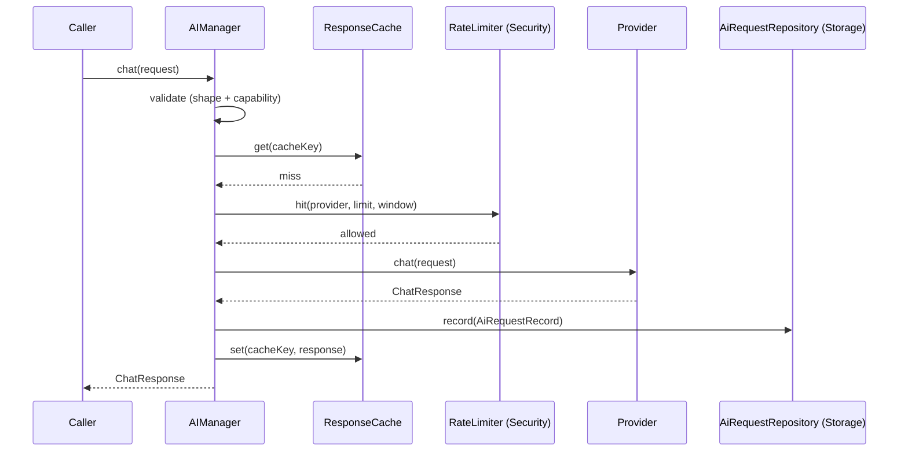
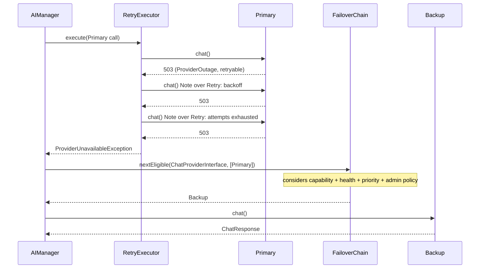
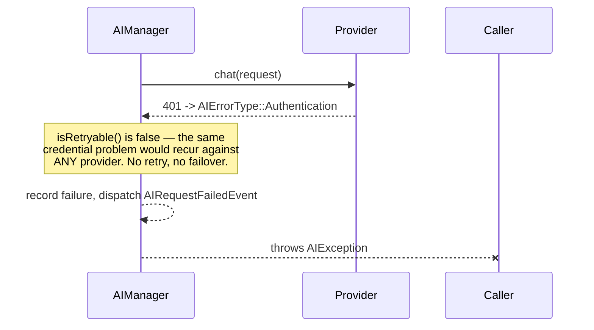

# Module 4: AI Provider Engine

The AI abstraction layer of the **AI Publishing Engine**. Every future module talks to `AIManager` — never to a concrete provider, never to `AIProviderInterface` directly. Full design rationale in `../../planning/AI_PROVIDER_ENGINE_DESIGN.md`; this README documents what was built.

## The mental model, realized

```
AIManager        → orchestration (retry, failover, cache, cost, events, recording)
ProviderRegistry → discovery (which providers exist, which is the default)
Provider Adapter → translation (this module's DTOs ↔ one vendor's wire format)
Storage          → persistence (AiRequestRepositoryInterface, MetricsRepositoryInterface — reused, not duplicated)
Security         → protection (OutboundHttpValidator, CredentialVault, RateLimiterInterface — reused, not duplicated)
```

Nothing outside `AIServiceProvider` ever writes `new ClaudeProvider(...)`. Every provider is resolved through `ProviderRegistryInterface`.

## Providers (7, as required)

| Provider | Class | How it's added |
|---|---|---|
| **Claude** (Anthropic) | `ClaudeProvider` | Dedicated adapter — Messages API shape (content blocks, `system` field, `input_schema`) genuinely differs from OpenAI's |
| **Gemini** (Google) | `GeminiProvider` | Dedicated adapter — `generateContent` shape (`parts`/`contents`, `functionDeclarations`, `x-goog-api-key` header) genuinely differs |
| **OpenAI** | `OpenAiCompatibleProvider` + `ProviderConfig('openai', ...)` | Configuration only |
| **OpenRouter** | `OpenAiCompatibleProvider` + `ProviderConfig('openrouter', ...)` | Configuration only |
| **DeepSeek** | `OpenAiCompatibleProvider` + `ProviderConfig('deepseek', supportsVision: false, ...)` | Configuration only |
| **Grok** (xAI) | `OpenAiCompatibleProvider` + `ProviderConfig('grok', ...)` | Configuration only |
| **Ollama** (self-hosted, OpenAI-compatible endpoint) | `OpenAiCompatibleProvider` + `ProviderConfig('ollama', baseUrl: admin-configured, secretKey: null, ...)` | Configuration only |

Five vendors, one class. Confirmed directly against each vendor's own current documentation that their chat API is OpenAI-compatible (see design doc Part 4) before making this call — this is the single biggest reduction in duplicated code in the module.

**Every provider extends `AbstractHttpProvider`**, which owns: SSRF-guarded HTTP (via Security's `OutboundHttpValidator` — no provider ever calls `wp_remote_*` directly), default HTTP-status error classification into `AIErrorType`, and a lightweight rolling health signal (transient-backed, no live ping cost on every check).

## Capability matrix

Same verified-against-current-docs matrix as the approved design (see design doc Part 4 for full detail and sourcing):

| Provider | Chat | Streaming | Vision | Tools | Structured Output | Image Gen | Embeddings | Speech |
|---|:---:|:---:|:---:|:---:|:---:|:---:|:---:|:---:|
| Claude | ✅ | ✅* | ✅ | ✅ | ✅ | ❌ | ❌ | ❌ |
| OpenAI | ✅ | ✅* | ✅ | ✅ | ✅ | not yet wired (ImageProviderInterface not implemented this module) | not yet wired | not yet wired |
| Gemini | ✅ | ✅* | ✅ | ✅ | ✅ | not yet wired | not yet wired | not yet wired |
| Grok | ✅ | ✅* | ✅ | ✅ | ✅ | not yet wired | ❌ | not yet wired |
| OpenRouter | ✅ | ✅* | config-dependent | config-dependent | config-dependent | ❌ | ❌ | ❌ |
| DeepSeek | ✅ | ✅* | ❌ (`supportsVision: false`) | ✅ | ✅ | ❌ | ❌ | ❌ |
| Ollama | ✅ | ✅* | config-dependent (model-dependent locally) | config-dependent | ✅ | ❌ | not yet wired | ❌ |

\* **Streaming is implemented but non-incremental in this module** — see "Streaming, honestly" below. This table reflects what's true at the `ChatProviderInterface`/`StreamingProviderInterface` level; `ImageProviderInterface`/`EmbeddingProviderInterface`/`SpeechProviderInterface` are defined (per the required interface list) but no provider implements them yet in this module — extending `ClaudeProvider`'s siblings with `ImageProviderInterface` etc. is exactly the kind of additive change the architecture supports without touching `AIManager`.

**Capability resolution is always provider + selected model, never provider alone** — `AIRequestValidator` checks both the coarse `instanceof` (structural: can this provider class ever do X) and, when the model is known, `ModelCatalogInterface::capabilitiesFor()` (specific: can *this model* do X right now). A known model's per-model data always wins over the coarse check.

## Sequence diagrams

**Happy path:**


**Retry then failover:**


**Non-retryable failure (no retry, no failover):**


## Retry classification (required: differentiate failure types)

`AIErrorType` enum: `Validation`, `Authentication`, `RateLimited`, `Quota`, `ProviderOutage`, `UnsupportedCapability`, `Unknown`. Only `RateLimited` and `ProviderOutage` are retryable — every other category fails fast, because retrying a bad request, a bad credential, an exhausted quota, or an unsupported capability cannot succeed by trying again. `AbstractHttpProvider::classifyHttpError()` maps HTTP status codes to these categories once, shared by every provider (400→Validation, 401/403→Authentication, 429→RateLimited *or* Quota depending on body content, 5xx→ProviderOutage).

## Failover policy (required: capability, health, priority, admin policy)

`FailoverChain::nextEligible()` filters candidates through all four, in order: capability (registry's `allImplementing()`), administrator exclusion (`ai.failover.excluded_providers` config), health (`healthCheck()->isEligibleForFailover()`), then sorts by configured priority (`ai.failover.priority`). Never picks blindly.

## Streaming, honestly

`StreamingProviderInterface` is real and implemented on every provider — but `wp_remote_post()` (which `OutboundHttpValidator` uses) returns a complete response, not an incremental stream. Every provider's `streamChat()` currently performs the full request and yields it as **one final chunk** — correct, callable, testable today, but not token-by-token. This matches the approved decision: streaming is implemented, but not the default path, and background publishing (the actual current workload) never needed incremental delivery. True incremental SSE reading needs a lower-level HTTP client (curl_multi with a write callback, still routed through `UrlGuard` first) — a natural fit for Module 7's async execution work, not duplicated here.

## Prompt templates: semantic versioning, write-once

`PromptTemplate` requires `MAJOR.MINOR.PATCH` version strings. `PromptTemplateRepository::saveNewVersion()` checks for an existing `(name, version)` pair and throws rather than overwrite — versions are immutable. `getLatest()`/`history()` sort by `version_compare()`, not SQL `ORDER BY` on the version string (lexicographic string sort is wrong for semver — `"10.0.0"` sorts before `"2.0.0"` as text). Two new tables, `ana_prompt_templates` and `ana_prompt_history`, created by AI-module-owned migrations that **reuse** Storage's `Connection`/`MigrationRunner`/`MigrationRecorder`/`AbstractMigration`/`AbstractRepository` classes — Storage's own migration history table (`ana_schema_migrations`) tracks both modules' migrations together, since `MigrationRunner`/`MigrationRecorder` are generic and take a migration list as a parameter per call, not baked into the class.

## Response caching

Transient-backed (`TransientResponseCache`), no new table — same reasoning as Security's `RateLimiter` and Storage's Settings-stays-on-options decisions. Cache key is a hash of everything that affects the response (model, messages, schema) and nothing that doesn't (no correlation id — two identical prompts with different correlation ids still hit the same cache entry). A cache hit costs zero: no rate-limit check, no provider call, no cost recorded.

## Cost calculation — separated from providers (required)

`ModelCatalogCostCalculator` implements `CostCalculatorInterface` by reading pricing purely from `ModelCatalogInterface`. No provider adapter computes its own cost. A pricing update means updating catalog data — never touching `ClaudeProvider`, `GeminiProvider`, or `OpenAiCompatibleProvider`.

## Model catalog — refreshable, not permanent (required)

`StaticModelCatalog` is an explicit, documented seed dataset — `refresh()` is a logged no-op here. A future implementation syncing from each provider's `/models` endpoint slots in via the same `ModelCatalogInterface`, with zero changes to `AIManager`, `AIRequestValidator`, or `ModelCatalogCostCalculator`, all of which depend on the interface.

## AI metrics (required: latency, tokens, cost, cache hits, retries, failovers, availability)

All routed through Storage's `MetricsRepositoryInterface` (reused, not duplicated): `ai.requests_total`, `ai.errors_total`, `ai.cache_hits`, `ai.cache_misses`, `ai.retries`, `ai.failovers`, `ai.rate_limited`, plus time-series events `ai.latency_ms`, `ai.cost_cents`, `ai.tokens` (each dimensioned by provider).

## Security review summary (full detail in design doc Part 5)

- Every outbound call goes through `OutboundHttpValidator` — no provider calls `wp_remote_*` directly.
- API keys go through `CredentialVault` (Security's Module 3-rebound `SecretsProviderInterface`), never plaintext options.
- Ollama's typical `localhost`/private-LAN address is a legitimate SSRF-guard exception the *administrator* must explicitly allowlist (Security's existing `ai_news_automator_url_allowlist` filter) — `UrlGuard`'s defaults are never weakened to accommodate it.
- Per-provider rate limiting (Security's `RateLimiterInterface`, reused) is mandatory in `AIManager`, not optional — cost-exhaustion via unbounded retry/failover is a real risk against paid APIs.
- Prompt injection sanitization is explicitly Sources/Research's responsibility (Modules 5/6), not this module's — this module safely transports a request, it doesn't author a safe one.

## Extension guide: adding a provider

**OpenAI-compatible vendor:** add one `ProviderConfig` entry in `AIServiceProvider::openAiCompatibleConfigs()`. No new class, no changes anywhere else.

```php
'my-new-vendor' => static fn (): ProviderConfig => new ProviderConfig(
    id: 'my-new-vendor',
    displayName: 'My New Vendor',
    baseUrl: 'https://api.myvendor.com/v1',
    secretKey: 'ai.my-new-vendor.api_key',
),
```

**Genuinely different API shape:** create one class extending `AbstractHttpProvider`, implementing whichever capability interfaces it actually supports, and register it in `AIServiceProvider::registerProviders()` + `populateProviderRegistry()`. `AIManager`, `FailoverChain`, and every future business-logic consumer see it immediately — they depend only on the segregated interfaces, never a concrete class.

## Testing strategy

**Genuinely offline, executable without any real provider** (65 test methods across 9 files): `AIManagerTest` (happy path, retry-then-success, retry-exhausted-then-failover, non-retryable-never-retries-or-fails-over, cache hit/miss, explicit provider override, event dispatch), `RetryExecutorTest` (every `AIErrorType` category's retry behavior), `FailoverChainTest` (capability, exclusion, priority, health — each in isolation), `AIRequestValidatorTest` (shape validation, provider-vs-model capability resolution, unknown-model graceful degradation), `StreamingTest`, `TransientResponseCacheTest`, `PromptTemplateTest` (semver validation, write-once enforcement, numeric-not-lexicographic ordering), `ModelCatalogCostCalculatorTest`, `ProviderRegistryTest`. `FakeChatProvider` (mirrors Module 3's `FakeWpdb` role) is the shared tool — a fully-scriptable provider double with no HTTP dependency.

**Honestly out of scope here, requiring real credentials and a live environment** (documented, not runnable in this sandbox): one integration smoke test per real provider adapter, verifying it correctly parses that vendor's *actual* current response shape — these catch API drift a fake provider structurally cannot. Not run in CI by default; gated behind an environment flag when written.

**Same limitation as every module**: no PHP/network runtime here. Validation performed: brace/paren balance across all 277 source files, PSR-4 correctness, one-type-per-file, every import resolved, and manual constructor-signature cross-checks between `AIServiceProvider`'s wiring and every class it constructs. Two real bugs were caught and fixed during that cross-check: `SecretsProviderInterface` imported from the wrong namespace in four files (it lives in `Core\Contracts`, not `Security\Contracts`), and a nonce-rendering call using raw `wp_nonce_field()` that would have bypassed `NonceManager`'s action-prefixing convention and never verified correctly. Run `composer test` locally for the behavioral confirmation this sandbox cannot provide.

## Future roadmap (explicitly out of scope here)

Fine-tuning APIs, batch API support (deferred until Module 7's queue exists to drive real batching patterns), cost-based provider routing (deferred until `ana_ai_requests` has real cost data to inform it), video generation. See design doc Part 11 for the full reasoning on each deferral.
